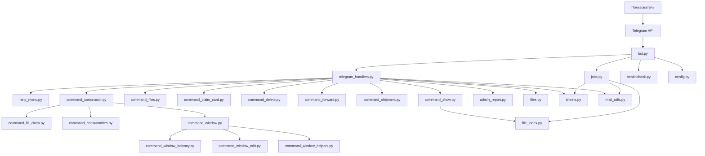
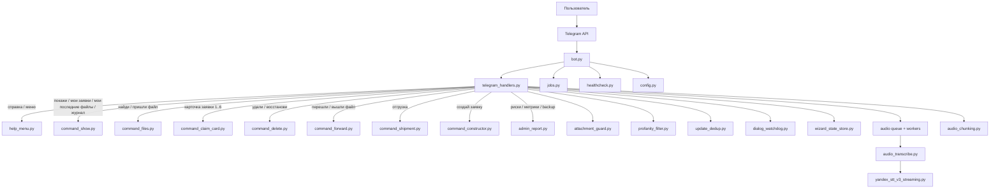
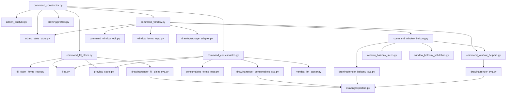

# Чат-бот «Учёт заявок по ущербу»
## Реальная техническая энциклопедия (актуально по коду)

Этот README описывает **фактическое поведение бота**: что реально работает, кто имеет право на действие, какие команды распознаются и как проходит диалог в чате.

Актуальные ревизии и изменения фиксируются в [CHANGELOG.md](CHANGELOG.md).

---

## 1. Карта ролей и прав (самое важное)

### 1.1 Кто есть кто

- `Администратор` — Telegram user_id входит в `TELEGRAM_ADMINS`.
- `Пользователь (ответственный по заявке)` — user_id привязан к ФИО в `TELEGRAM_USER_MAP`, и это ФИО совпадает с составителем заявки.
- `Участник чата без привязки` — нет пары user_id → ФИО.

### 1.2 Что разрешено

| Действие | Админ | Ответственный пользователь | Пользователь по чужой заявке / без привязки |
|---|---|---|---|
| Просмотр карточки заявки | Да | Да | Да |
| Просмотр файлов из карточки | Да | Да | По `FILE_VIEW_STRICT_ACL` |
| Прямая команда `найди/пришли файл ...` | Да | Да | Да (текущее поведение) |
| Правка формы заявки | Да | Да (своей) | Нет |
| Удаление файлов заявки | Да | Да (только своих) | Нет |
| Dry-run удаления | Да | Да (только своих) | Нет |
| Пересылка на e-mail | Да | Да (только своих) | Нет |
| Dry-run отправки | Да | Да (только своих) | Нет |
| Отгрузка на объект | Да | Да (только своих) | Нет |
| Восстановление из архива удалений | Да (только спец-админы) | Нет | Нет |
| Админ-отчеты (`риски/метрики/бэкап`) | Да | Нет | Нет |

### 1.3 Важное ограничение по восстановлению

- По коду `command_delete.py` восстановление удалённых файлов разрешено только спец-админам (`Лапкин А.О` / `Клочков А.М`).
- Если пользователь пытается восстановить свою заявку, бот отвечает: обратиться к Лапкину А.О.

### 1.4 Прямой ответ на ваш вопрос

- Да: **пользователи не могут удалять чужие заявки/файлы**.
- При попытке бот отвечает: `Удаление запрещено: можно удалять только свои файлы.`

---

## 2. Команды: кратко, ёмко, с примерами

Ниже не «общие слова», а рабочие команды из обработчиков.  
Формат каждого пункта: что вводит пользователь, что видит в ответ, и что в этот момент происходит внутри бота.

## 2.1 Сервис и помощь

### `справка`, `меню`, `help`, `/help`, `/menu`

Мини-кейс:
- Пользователь пишет: `справка`
- Бот возвращает компактное меню всех рабочих сценариев.

Под капотом:
- Триггеры нормализуются (регистр/пробелы), поэтому команда узнаётся стабильно.
- Возвращается единый справочник из `help_menu.py`, чтобы все пользователи видели одинаковую «карту» возможностей.
- В глобальном меню есть отдельный пункт `9 — Голосовое управление`.

Точное глобальное меню сейчас такое:
- `1` — Поиск заявок по номерам
- `2` — Работа с таблицей №№
- `3` — Создание заявок
- `4` — Правка и отправка
- `5` — Отгрузка на объект
- `6` — Удаление и восстановление
- `7` — Журнал действий
- `8` — Dry-run (без изменений)
- `9` — Голосовое управление
- `0` — Выход из меню

### Постоянные кнопки и кабинеты

В чатах включена постоянная клавиатура (`ReplyKeyboardMarkup`, `is_persistent=True`):
- В общем чате: `Меню`, `Личный кабинет`.
- В личном кабинете (приват): `Меню`, `Общий кабинет`.

Как это работает:
- `Личный кабинет` в общем чате отправляет кнопку-переход в приват (`/start cabinet`).
- В привате бот пишет приветствие: `Уважаемый(ая) ... добро пожаловать в личный кабинет.`
- В личном кабинете удобно использовать быстрые персональные команды:
  - `мои заявки`
  - `мои последние файлы`
- `Общий кабинет` в привате отправляет кнопку/подсказку возврата в общий чат.
- Эти переходы работают и голосом:
  - `войти в личный кабинет`;
  - `открой личный кабинет`;
  - `перейди в личный кабинет`;
  - `войти в общий кабинет`;
  - `открой меню`.

Важно про приватность:
- личный кабинет — это отдельный приватный чат с ботом;
- ваши действия в личке не публикуются в общий чат автоматически;
- в общий чат уходит только то, что вы явно отправили туда сами.

Доступ в личный кабинет:
- По умолчанию открыт для всех пользователей (`TELEGRAM_PRIVATE_CABINET_OPEN_ACCESS=1`).
- При необходимости можно ужесточить до allowlist через `TELEGRAM_PRIVATE_CABINET_OPEN_ACCESS=0` и `TELEGRAM_PRIVATE_CABINET_USER_IDS`.

### `/status` и `/health`

Мини-кейс:
- Пользователь пишет: `/status`
- Бот отвечает диагностикой: `RELEASE`, `SHEETS`, `MAIL`, `MAIL_SPOOL`, `DEAD_LETTER_SIZE`, `HEARTBEAT_AGE`.

Под капотом:
- Бот собирает статус из живых runtime-данных (`bot_data`) + heartbeat-файла.
- Это быстрый “пульт оператора”: сразу видно, где проблема — сеть, таблица, почта, очередь.

### `/modcheck` (проверка фильтра мата, только админ)

Рабочие варианты:
- `/modcheck`
- `modcheck`
- `проверка фильтра`
- `проверь фильтр`

Что делает:
- запускает встроенный самотест фильтра (`profanity_filter.py`) на нескольких типах маскировки;
- возвращает отчёт `OK/FAIL` по блокам: базовые формы, смешанный алфавит, leet-замены, мягкий мат, белый список.

Важно:
- команда доступна только администратору.

### `кнопки`, `покажи кнопки`, `обнови кнопки`, `верни кнопки`

Что делает:
- заново отправляет постоянную клавиатуру под полем ввода для текущего типа чата:
  - в группе: `Меню`, `Личный кабинет`;
  - в личке: `Меню`, `Общий кабинет`.

Зачем это нужно:
- если Telegram-клиент временно «потерял» клавиатуру, одной командой можно вернуть её без перезапуска диалога.

### Публикация в общий кабинет

Из карточки заявки (`command_claim_card.py`):
- Добавлен пункт `6` — `опубликовать в общем кабинете`.
- Публикует выбранные файлы в основной чат и пишет служебное уведомление с автором.

Из конструктора балконного блока (`command_window_balcony.py`):
- В меню сохранения добавлен пункт `2` — `сохранить и опубликовать в общем кабинете`.
- Публикация выполняется после финального подтверждения заявки.

---

## 2.2 Поиск заявок

### Одна заявка

Рабочие форматы:
- `ЖА-34`
- `жа34`
- `покажи ЖА-34`

Мини-кейс:
- Пользователь пишет: `ЖА-34`
- Бот возвращает: составитель, объект, заказ, дата и текущий статус.

Под капотом:
- Номер нормализуется (`ЖА34`, `жа-34`, `ЖА 34` -> один формат).
- Поиск идёт через кэш `ClaimsCache`; если он устарел, бот обновляет его из Sheets.

### Список заявок по префиксу

Рабочие форматы:
- `покажи заявки ЖА`
- `покажи 5 заявок ЖА`
- `покажи жа`

Мини-кейс:
- Пользователь пишет: `покажи 5 заявок ЖА`
- Бот показывает 5 последних заявок префикса `ЖА`.

Под капотом:
- Сначала выбирается пул по префиксу, затем сортировка по дате.
- Ограничение выборки защищает чат от перегрузки длинными списками.

### Персональный список заявок

Рабочая команда:
- `мои заявки`
- `мои заявки 15` (лимит 1..50)

Мини-кейс:
- Пользователь в личном кабинете пишет: `мои заявки`
- Бот показывает последние заявки, где составитель совпадает с привязкой `Telegram user_id -> ФИО`.

Под капотом:
- Используется `TELEGRAM_USER_MAP`; если привязки нет, бот просит обратиться к администратору.
- Выборка идёт из текущего кэша/Google Sheets по полю `composer`, с сортировкой по дате (свежие сверху).

### Персональный список последних файлов

Рабочая команда:
- `мои последние файлы`
- `мои последние файлы 10` (лимит 1..30)

Мини-кейс:
- Пользователь в личном кабинете пишет: `мои последние файлы`
- Бот показывает последние персональные файлы в понятном формате:
  - `1. ЖА-34 — эскиз ПВХ-блока — 12.03.2026 (создан в боте)`
  - `2. ЖА-35 — расходники — 12.03.2026 (получен по e-mail)`
- После этого пользователь может нажать номер файла или `0` для выхода.

Под капотом:
- Команда работает только для пользователя, чей `Telegram user_id` привязан к ФИО в `TELEGRAM_USER_MAP`.
- Список строится по файловому индексу и меткам происхождения файла:
  - `создан в боте`
  - `получен по e-mail`
  - `получен в чате`
- Если файлов пока нет, бот отвечает мягко и без ошибки.
- Если при сборе списка случился внутренний сбой, бот не падает, а отвечает: `Не удалось сформировать список последних файлов. Попробуйте позже.`

### Журнал действий по заявке

Команда:
- `покажи журнал ЖА-34`

Мини-кейс:
- Пользователь запрашивает журнал.
- Бот показывает: кто и когда открывал/отправлял/удалял/восстанавливал.

Под капотом:
- Источник: `claim_audit`.
- Доступ — только админ или ответственный по заявке (ACL-проверка перед выводом).

---

## 2.3 Таблица реестра

### `покажи таблицу`

Мини-кейс:
- Пользователь пишет: `покажи таблицу`
- Бот отдаёт текстовый срез реестра.

Под капотом:
- Это “лёгкий” режим, когда важна скорость и не нужна графика.

### `покажи таблицу красиво`

Мини-кейс:
- Пользователь пишет: `покажи таблицу красиво`
- Бот отправляет PNG-таблицу для удобного просмотра в чате.

Под капотом:
- Рендер идёт через Pillow; при недоступности рендера бот не падает, а даёт понятный ответ.

---

## 2.4 Файлы заявок

### Персональный быстрый доступ к последним файлам

Команда:
- `мои последние файлы`

Что делает:
- показывает последние персональные файлы пользователя без необходимости помнить номер заявки;
- позволяет открыть файл прямо по номеру из списка (`1..N`);
- `0` завершает выбор без побочных действий.

Зачем это нужно:
- это быстрый рабочий список документов, когда прораб помнит не номер заявки, а то, что недавно уже работал с ней.

### Базовые команды

Рабочие форматы:
- `покажи файл ЖА-34`
- `пришли файл ЖА-34`
- `найди файл ЖА-34`
- `найти файлы ЖА-34`

Мини-кейс:
- Пользователь пишет: `найди файл ЖА-34`
- Если версия одна — бот отправляет сразу; если версий несколько — предлагает список 1..N.

Под капотом:
- Поиск опирается на файловый индекс и версионирование (`verN`), поэтому работает быстрее ручного обхода папок.

### Поиск по одному префиксу

Мини-кейс:
- Пользователь пишет: `пришли файл ЖА`
- Бот показывает последние 5 заявок по этому префиксу и просит выбрать.

Под капотом:
- Это быстрый “поиск по серии”, когда номер помните не полностью.

### Безымянные файлы

Команды:
- `покажи файлы без имени`
- `покажи безымянные файлы`

Мини-кейс:
- Пользователь просит безымянные файлы.
- Бот отдаёт файл/список выбора.

Под капотом:
- Для неадминов включается фильтр по владельцу, чтобы чужие безымянные файлы не “утекали” в интерфейс.

### Защита входящих файлов (антивирусный контур на уровне бота)

Что проверяется при загрузке файла в чат и из e-mail:
- расширение файла входит в белый список `ALLOWED_ATTACHMENT_EXTENSIONS`;
- размер не превышает `MAX_ATTACHMENT_MB` (по умолчанию 45 МБ);
- сигнатура не похожа на опасный исполняемый файл (`MZ`) и соответствует типу.

Как реагирует бот:
- отклоняет подозрительный файл с понятным текстом причины;
- пишет событие в метрики `security.attachment_blocked`;
- не роняет диалог и продолжает работу.

---

## 2.5 Карточка заявки (единое меню действий)

Как открыть:
- просто отправить номер заявки: `ЖА-34`.

Бот показывает меню:
- `1` — просмотреть файлы
- `2` — отредактировать заявку
- `3` — отправить на e-mail
- `4` — удалить
- `5` — отредактировать выбранную версию
- `6` — опубликовать в общем кабинете
- `0` — оставить без изменений

Мини-кейс:
- Пользователь открывает `ЖА-34` и выбирает `3`.
- Бот запускает ветку отправки именно в контексте этой заявки, без повторного ввода номера.

Под капотом:
- Карточка хранит состояние текущей заявки и ускоряет все действия внутри неё.
- Выбор файлов поддерживает диапазоны (`1-3`) и точный выбор по имени (`ЖА-34.ver2`).
- При отправке из личного кабинета в общий чат бот подписывает публикацию в вежливом формате (по ФИО из привязки `Telegram user_id -> ФИО`).
- Если файл эскиза хранится как SVG, для просмотра бот старается отправить PNG (чтобы открывалось на смартфоне удобнее).

---

## 2.6 Правка заявок

### Универсальная правка

Команды:
- `правка ЖА-34`
- `правка` (бот попросит номер)

Мини-кейс:
- Пользователь пишет: `правка ЖА-34`.
- Бот открывает сохранённую форму и ведёт по полям редактирования.

Под капотом:
- Поднимается сохранённый payload формы (окно/балкон/заполнения/расходники).
- После изменения параметров бот пересобирает визуал и сохраняет новую версию.

### Точечные режимы

- `правка заполнения ЖА-355`
- `правка расходники ЖА-888`

Под капотом:
- Переход сразу в профильный модуль, без общего меню.

---

## 2.7 Создание заявок (конструкторы)

Команда входа:
- `создай заявку`

Меню:
1. создать заявку на заполнения — **активно**
2. переделка рамы/створки — **план (в разработке)**
3. создать эркер — **план (в разработке)**
4. создать балконный блок / оконный блок — **активно**
5. создать заявку на расходники — **активно**

Также работают прямые фразы:
- `создать балконный блок`
- `создай окно`
- `создать заявку на расходники`
- `создать заявку на заполнения`

### Отдельная команда для «простого окна»: `создай окно`

Бот запускает конструктор окна с выбором одного из 5 эскизов:
1. Глухая
2. Поворотная (левая)
3. Поворотная (правая)
4. Поворотно-откидная (левая)
5. Поворотно-откидная (правая)

Мини-кейс:
- Вы: `создай окно`
- Бот: собирает данные, показывает каталог эскизов 1..5, формирует SVG + PNG-превью.

Под капотом:
- Диалоговые шаги сохраняются, поэтому при рестарте бот может продолжить с последнего подтверждённого этапа.

### Экспресс-сценарий: `заявка для альтавина ...`

Рабочий формат запуска:
- `заявка для альтавина: ...`
- `заявка в альтавин: ...`

Что умеет:
- извлекает габариты (в том числе из фраз формата `2200x800`, `2200 х 800`, `высота ... ширина ...`);
- распознаёт фурнитуру по словарю синонимов (например, `MACO`, `WinkHaus proPilot`, `FUTURUSS`);
- запускает быстрый сбор черновика по балконному профилю без лишнего «ручного» ввода.

Зачем это полезно:
- когда нужно быстро надиктовать или ввести заявку в одном сообщении, без прохождения полного длинного мастера шаг за шагом.

---

## 2.8 Удаление (с двухшаговым подтверждением)

### Удалить файлы заявки

Команда:
- `удали файл ЖА-34`

Диалог:
1. выбор файла/файлов
2. подтверждение `1`
3. повтор номера заявки (второй барьер)

Что делает:
- переносит файл в архив удалений на `DELETED_RETENTION_DAYS`.

Под капотом:
- Вместо “жёсткого удаления” файл сначала маркируется/архивируется, чтобы была возможность восстановления.

### Удалить безымянные

Команды:
- `удали безымянные файлы`
- `удали файл без имени`

Права:
- админ удаляет любые;
- пользователь — только свои (по фамилии в имени файла).

### Dry-run удаления

Команда:
- `проверь удаление ЖА-34`

Что делает:
- показывает, какие файлы будут удалены, **без фактического удаления**.

---

## 2.9 Восстановление удалённых файлов

Команды:
- `восстановить файл ЖА-34`
- `восстанови заявку ЖА-34`

Мини-кейс:
- Пользователь запрашивает восстановление.
- Бот проверяет права и, при допуске, предлагает выбрать файл(ы) из архива удалений.

Права:
- в текущей бизнес-логике восстановление выполняют только спец-админы.

---

## 2.10 Пересылка файлов на e-mail

Команды:
- `перешли файл ЖА-34`
- `вышли файл ЖА-34`

Сценарий:
1. Номер заявки
2. Выбор файла
3. Выбор адресатов (из списка или `руч` для ручного ввода)
4. Подтверждение отправки

Мини-кейс:
- Пользователь подтверждает отправку.
- Бот сообщает итог по каждому адресату (успех/ошибка).

Под капотом:
- Бот проверяет ACL (админ или ответственный по заявке), собирает вложения и шлёт по SMTP.
- При проблемах почты фиксирует ошибку по адресату и не “теряет” контекст отправки.

### Dry-run отправки

Команда:
- `проверь отправку ЖА-34`

Что делает:
- показывает список файлов и доступных адресатов, **без отправки писем**.

Права:
- админ или ответственный по заявке.

---

## 2.11 Отгрузка на объект

Команды запуска:
- `отгрузка на объект`
- `запрос отгрузки`

Формат ввода:
- `ЖА-34 10.03 15:00`
- `ЖА-34 10 марта 15:00`

Мини-кейс:
- Пользователь вводит заявку и время.
- Бот отправляет письмо Любови Николаевне и ставит копии ответственным.

Под капотом:
- Перед отправкой идёт ACL-проверка (админ/ответственный по заявке) + сбор данных объекта и заказа из реестра.

---

## 2.12 Админ-команды

- `покажи риски` / `покажи аномалии` — риск-отчёт за 24 часа.
- `покажи метрики` / `метрики` — runtime counters и тайминги.
- `покажи индекс файлов` — статистика SQLite-индекса.
- `покажи бэкап` — состояние backup.
- `сделай бэкап` — ручной запуск backup.

Мини-кейс:
- Админ пишет `покажи риски` и видит: ACL-отказы, блокировки вложений, массовые отправки, удаления/восстановления.

Под капотом:
- Отчёт строится по реальному журналу действий (`claim_audit`) и runtime-метрикам.
- Это позволяет не гадать “что случилось”, а видеть факты за последние 24 часа.

---

## 2.13 Служебный сценарий «отправил ...»

Фраза вида:
- `отправил ЖА-34`

Что делает:
- моментально добавляет номер заявки в контрольный список `sent_claims.json`;
- сразу пишет подтверждение: через сколько часов выполнит контроль (`HOURS_TO_WAIT`, по умолчанию 36 ч);
- фоновый job `check_sent_claims` проверяет список с интервалом `CHECK_INTERVAL_MINUTES` (по умолчанию каждый час);
- когда время ожидания истекло, бот сверяет номер с кэшем/реестром:
  - если заявка найдена — снимает с контроля;
  - если не найдена — отправляет в чат предупреждение:  
    `⚠️ ВНИМАНИЕ, Заявка № ЖА-34 в таблицу не заведена, обратитесь к Ларисе!`.
- повторные одинаковые тревоги режутся mem-guard (24 часа).

---

## 2.14 Голосовой режим и YandexGPT (подробно)

Это один из ключевых рабочих контуров бота.
Схема простая: **голос -> распознавание -> текст -> обычная маршрутизация команд**.

### Как это выглядит для пользователя

1. Вы отправляете голосовое в общий чат или личный кабинет.
2. Бот отвечает: `Аудио принято. Распознаю в фоне...`
3. Через короткое время бот показывает распознанный текст:
   - `Распознано: ...`
   - или `Распознано (частями N): ...` для длинной записи.
4. Далее бот запускает тот же сценарий, как если бы вы ввели этот текст руками.

### Что можно делать голосом уже сейчас

- искать заявки по номеру;
- открывать меню (`открой меню`, `покажи меню`);
- переходить в кабинет:
  - `войти в личный кабинет`,
  - `открой личный кабинет`,
  - `перейди в личный кабинет`;
- возвращаться в общий кабинет:
  - `войти в общий кабинет`,
  - `перейди в общий кабинет`,
  - `открой общий кабинет`;
- запускать конструкторы (`создай балконный блок`, `создай заявку на расходники`);
- работать в карточке заявки (включая нумерованные ответы).

### Важный нюанс про «0» и голос

В меню справки и в ряде сценариев `0` можно и нажимать, и произносить.
Но в сценариях, где бот ожидает номер заявки, слово `ноль` может быть интерпретировано как номер.
Поэтому в таких шагах лучше говорить явно: `выход`, `назад`, `отмена`, `стоп` — это надежнее.

### Как устроен STT в коде

Точка входа:
- `telegram_handlers.py` -> `handle_audio_message` -> очередь -> worker.

Реализации распознавания:
- `audio_transcribe.py`:
  - `yandex` (SpeechKit v1 sync),
  - `yandex_v3` (streaming gRPC),
  - `openai` (whisper API) — как альтернативный провайдер.
- `yandex_stt_v3_streaming.py`:
  - потоковая отправка чанков,
  - сбор partial/final/final_refinement,
  - опциональная summarization-секция.

### Почему бот не «сыпется» на длинном аудио

- Для `yandex` есть лимит синхронной длительности (`YANDEX_STT_SYNC_MAX_SEC`).
- Если голос длинный, бот умеет авто-нарезку (`AUDIO_AUTO_CHUNK_ENABLED=1`):
  - делит аудио на части через ffmpeg,
  - распознаёт части по очереди,
  - склеивает итог с overlap-коррекцией.
- Есть защита очереди (`AUDIO_QUEUE_MAX_ITEMS`), чтобы пик нагрузки не уронил обработку.
- Есть повторные попытки для временных ошибок API (`AUDIO_TRANSCRIBE_RETRY_COUNT`).

### Когда подключается YandexGPT и зачем

YandexGPT в текущем коде включен **не глобально на все команды**, а точечно:

- `LLM_SCOPE: consumables_parser_only` (это видно и в `/status`);
- модуль: `command_consumables.py` + `yandex_llm_parser.py`.

Идея такая:
- сначала работает локальный `rule-based parser` (детерминированный парсер по правилам) и строит baseline-результат;
- затем срабатывает `gating` (шлюз принятия решения): звать LLM или нет;
- LLM вызывается только при сигналах риска: низкий baseline quality-score, “слипшиеся” фрагменты количества/единиц в названии, длинная/шумная фраза, слабое покрытие позиций;
- если LLM вызван, бот проводит `quality arbitration` (сравнение кандидатов по качеству): локальный результат против LLM-результата;
- оценка идет по эвристическому scoring:
  - completeness: есть ли `qty` и `unit`;
  - validity: корректна ли единица измерения;
  - cleanliness: нет ли мусора в `item_name`;
  - duplicate penalty: штраф за повторы;
  - row-count bonus: бонус за большее число валидных строк;
- после подсчета выбирается победитель:
  - LLM берется, если он заметно лучше по score или заметно полнее при близком score;
  - иначе остается локальный baseline.
- важный нюанс: self-confidence LLM сейчас не главный фактор выбора; финальное решение принимает внутренний quality-контур бота.

Это дает баланс:
- экономия на LLM вызовах (нет лишних запросов);
- повышение качества на сложных голосовых фразах;
- контролируемая стоимость эксплуатации.

### Когда LLM не вызывается (экономия бюджета)

- если текст слишком короткий (`YC_LLM_PARSER_MIN_CHARS`);
- если локальный парсер уже дал качественный результат;
- если LLM отключен ENV-флагами.

### Что важно для стабильной работы Voice + LLM

- SpeechKit ключи:
  - `YANDEX_SPEECHKIT_API_KEY` или `YANDEX_SPEECHKIT_IAM_TOKEN`;
- для LLM:
  - `YC_LLM_ENABLED=1`,
  - `YC_LLM_API_KEY`,
  - `YC_LLM_MODEL_URI`,
  - `YC_LLM_PARSER_ENABLED=1`.

Если что-то не так, `/status` показывает готовность контуров:
- `AUDIO_READY`,
- `LLM_READY`,
- `LLM_PARSER_READY`.

---

## 2.15 Полный словарь рабочих команд (по коду, с синонимами)

Ниже собраны **реальные триггеры из модулей**, чтобы не искать по коду.
Если в формулировке есть опечатка, бот часто все равно поймёт (много синонимов и мягкая нормализация).

### Навигация и справка

- `справка`, `меню`, `команды`, `помощь`, `help`, `/help`, `/menu`
- `открой меню`, `покажи меню`, `выведи меню`, `включи меню`
- `кнопки`, `покажи кнопки`, `обнови кнопки`, `верни кнопки`

### Переходы между кабинетами

- `личный кабинет` (кнопка или текст)
- `войти/перейти/открой личный кабинет`
- `общий кабинет` (кнопка или текст)
- `войти/перейти/открой общий кабинет`

### Поиск и просмотр заявок

- прямой номер: `ЖА-34`, `жа34`, `КМ112`
- `покажи ЖА-34`
- `покажи заявки ЖА`
- `покажи 5 заявок ЖА` (обычно 5..50)
- `мои заявки`, `мои заявки 10`
- `мои последние файлы`, `мои последние файлы 10`
- `покажи журнал ЖА-34`

### Таблица реестра

- `покажи таблицу`
- `покажи таблицу красиво`

### Файлы заявки

- `мои последние файлы`, `мои последние файлы 10`
- `покажи файл ...`, `покажи файлы ...`
- `пришли файл ...`, `пришли файлы ...`, `пришли мне файл ...`, `пришли файл сюда ...`
- `найти файл ...`, `найти файлы ...`, `найди файл ...`, `найди файлы ...`
- безымянные: `покажи безымянные`, `покажи безымянные файлы`, `покажи файлы без имени`

### Создание заявок (конструктор)

- общий вход: `создай заявку`, `создать заявку`, `создание заявки`
- прямой вход в режимы:
  - `создать/создай заявку на заполнения`
  - `создать/создай балконный блок`
  - `создай окно`
  - `создать/создай заявку на расходники`
  - `покажи расходники`, `заявка расходники`
- отдельный экспресс-триггер:
  - `заявка для альтавина: ...`

### Правка и действия из карточки

- `правка` (общий вход в правку)
- `правка ЖА-34`, `правка заявки ЖА-34`
- `правка заполнения ЖА-355`
- `правка расходники ЖА-888`
- в карточке действия цифрами:
  - `1` просмотр;
  - `2` редактирование;
  - `3` e-mail;
  - `4` удаление;
  - `5` редактировать выбранную версию;
  - `6` публикация в общем кабинете;
  - `0` оставить без изменений.

### Удаление и восстановление

- удаление: `удали файл ...`, `удалить файл ...`
- удаление безымянных: `удали безымянные файлы`, `удали файл без имени`
- dry-run удаления: `проверь удаление ...`, `проверить удаление ...`
- восстановление: `восстанови файл ...`, `восстановить файл ...`, `восстанови заявку ...`

### Пересылка на e-mail

- `перешли файл ...`, `перешли заявку ...`
- `вышли файл ...`, `вышли заявку ...`
- dry-run отправки: `проверь отправку ...`, `проверить отправку ...`

### Отгрузка на объект

- `прошу отгрузить ...`
- `нужно отгрузить ...`
- `надо отгрузить ...`
- `отгрузить ...`, `отгрузка на объект`, `запрос отгрузки`, `запросить отгрузку`
- кодовые фразы: `свяжись ...`, `да свяжись ...`, `организуй доставку ...`, `организуй вывоз ...`

### Служебные и админ-команды

- контроль отправленной заявки: `отправил ЖА-34`
- админ-отчеты:
  - `покажи риски`, `покажи аномалии`
  - `покажи метрики`, `метрики`
  - `покажи индекс файлов`, `покажи file index`
  - `покажи бэкап`, `покажи backup`, `сделай бэкап`, `сделай backup`
- проверка мата (админ): `/modcheck`, `modcheck`, `проверка фильтра`, `проверь фильтр`

### Голос и меню

- В голосовом сценарии возврат `0` работает в меню справки и ряде диалогов.
- Также поддерживаются голосовые формы `ноль`, `нуль`.
- Если сценарий не распознан, бот подсказывает перейти в `Меню` и дать более короткую фразу.

---

## 3. Реальные мини-сценарии из чата

### 3.1 Пользователь ищет и отправляет файл

1. `найди файл ЖА-777`
2. Бот: список версий
3. Пользователь: `2`
4. Бот: отправляет выбранный файл

### 3.2 Пользователь пытается удалить чужую заявку

1. `удали файл ЖА-500`
2. Бот: `Удаление запрещено: можно удалять только свои файлы.`

### 3.3 Пользователь пытается восстановить удалённый файл

1. `восстановить файл ЖА-500`
2. Бот: `Для восстановления заявки № ЖА-500 обратитесь к Лапкину А.О.`

### 3.4 Админ проверяет риски

1. `покажи риски`
2. Бот: сводка по удалениям, восстановлению, ACL-отказам, дубликатам и блокировкам вложений.

### 3.5 Прораб работает в личном кабинете, не мешая общему чату

1. В общем чате: `Личный кабинет` (кнопка или голос).
2. Бот дает кнопку перехода в приват.
3. В привате запускается сценарий правки/создания.

Важно:
- действия в личном кабинете видны только в личном чате с ботом;
- в общий чат уходит только то, что пользователь сам публикует (например, пунктом `опубликовать в общем кабинете`).

### 3.6 Голосом открыть личный кабинет

1. Пользователь надиктовывает: `войти в личный кабинет`.
2. Бот распознает и отправляет кнопку входа в личку.
3. В личке можно продолжить уже кнопками или также голосом.

### 3.7 Голосовая диктовка расходников

1. Голос: `Герметик А 4 штуки, анкер с проушиной 20 штук...`
2. Локальный парсер выделяет позиции.
3. Если фраза сложная, подключается YandexGPT-парсер.
4. Бот формирует строки и продолжает мастер расходников.

### 3.8 Отгрузка списком без ручного ввода даты/времени

1. `прошу отгрузить ПД-31, ПЖ-32`
2. Бот проверяет права, статус `НА БАЗЕ`, формирует e-mail Любови Николаевне, ставит копии ответственным.
3. В чат возвращается человеческое подтверждение, что запрос отправлен.

### 3.9 Прораб быстро открывает свой последний файл

1. В личном кабинете: `мои последние файлы`
2. Бот:
   - `Андрей Игоревич, ваши последние файлы:`
   - `1. ЖА-34 — эскиз ПВХ-блока — 12.03.2026 (создан в боте)`
   - `2. ЖА-35 — расходники — 12.03.2026 (получен по e-mail)`
3. Пользователь: `1`
4. Бот отправляет выбранный файл.

### 3.10 Старый диалог истёк, но бот не путает пользователя

1. Прораб раньше работал с расходниками, потом надолго отвлёкся.
2. При следующем сообщении бот пишет:
   - `Андрей Игоревич, ранее вы занимались расходниками.`
   - `Показать мои последние файлы, - нажмите: 1`
   - `Завершить, - нажмите: 0`
3. Пользователь: `1`
4. Бот открывает список `мои последние файлы`, а не пытается вслепую продолжить старый шаг.

### 3.11 Истёкший диалог без понятного контекста

1. Старое состояние устарело, но бот не может уверенно понять, чем именно занимался пользователь.
2. Бот пишет:
   - `Андрей Игоревич, предыдущую задачу я аккуратно завершил после паузы и готов к новой работе.`
3. Пользователь продолжает работу новой командой без лишней путаницы.

### 3.12 Сценарий «отправил ...» и вечерний контроль

1. Пользователь пишет: `отправил ЖА-34`.
2. Номер попадает в `sent_claims`.
3. По расписанию отдельный контроль сверяет фактическое наличие в таблице.
4. Если не найдено, бот поднимает тревогу в чат.
5. Это спокойный ручной контур контроля: он живёт отдельно и не смешивается с вечерним почтовым отчётом `18:00`.

### 3.13 Вечерний отчет 18:00 (реестр + незаведенные)

1. В `18:00`, с понедельника по субботу, бот отправляет спокойную вечернюю сводку:
   - что заведено сегодня в таблицу;
   - что еще не заведено из почтовых писем.
2. Раздел «не заведены» строится сравнением:
   - отдельного почтового реестра `mail_report_claims.json`,
   - и фактических номеров в Google Sheets.
3. В этот реестр попадает не “всё подряд”, а только понятный почтовый след:
   - входящие письма на почту бота, если в имени вложения найден номер заявки;
   - успешные письма, отправленные ботом на `lori_ng@mail.ru`, `alapkin@inbox.ru`, `begashvili1@yandex.ru`, если во вложении есть файл с номером этой же заявки.
4. Одно письмо может принести сразу несколько заявок: бот смотрит на каждое вложение отдельно.
5. Тема письма здесь только помогает сориентироваться. Если тема и имя файла расходятся, для вечернего отчёта важнее имя вложения.
6. Если в имени вложения номер заявки не читается, такое вложение в отчёт `18:00` не попадает.

### 3.14 Защита от «дублирующихся» сообщений Telegram

1. Telegram прислал повтор update.
2. Бот вычисляет dedup-ключ (`event_type + update_id + chat_id + message_id`).
3. Повтор отбрасывается.
4. Пользователь не получает дубль ответа/дубль действия.

### 3.15 Мат-фильтр в живом чате

1. Пользователь отправляет токсичное сообщение.
2. Бот маскирует матерные части.
3. При необходимости удаляет исходное сообщение.
4. В метриках появляется событие `security.profanity_masked`.

---

## 4. Архитектура (две версии карты)

Ниже — две карты одного и того же проекта.

- Короткая архитектурная версия нужна, чтобы за один взгляд понять, как вообще устроен бот.
- Полная техническая версия показывает уже не роли, а реальные связи модуль → модуль.

Чтобы полная версия не превратилась в “клубок проводов”, я разбил её на несколько вертикальных схем. Так её можно читать и с ноутбука, и с телефона.

### 4.1 Короткая архитектурная карта



Коротко по смыслу:
- `bot.py` поднимает приложение и фоновые задачи;
- `telegram_handlers.py` — это главный диспетчер сообщений, документов и аудио;
- прикладные сценарии живут в `command_*`;
- конструкторы формируют файлы и эскизы;
- данные и интеграции сходятся в `files.py`, `file_index.py`, `sheets.py`, `mail_utils.py`.

## 4.2 Полное техническое дерево взаимодействия

Это уже не “общее впечатление”, а рабочая карта живых связей.  
Именно здесь видно, как новая команда `мои последние файлы`, карточка заявки, почта, фоновые job'ы и конструкторы пересекаются друг с другом.

### 4.2.A Ядро, маршрутизация и прикладные команды



### 4.2.B Конструкторы, формы и рендер файлов



### 4.2.C Данные, индекс, почта, фоновые задачи и внешний контур

```mermaid
flowchart TD
    TH[telegram_handlers.py] --> FILES[files.py]
    TH --> SHT[sheets.py]
    TH --> MU[mail_utils.py]
    TH --> MET[metrics.py]

    SH[command_show.py] --> FL[command_files.py]
    SH --> IDX
    SH --> SHT
    SH --> FILES
    SH --> MET
    SH --> JOBCHK[jobs.py]

    FL --> FILES
    FL --> SHT

    CC[command_claim_card.py] --> AUD
    CC --> DELU[delete_utils.py]
    CC --> FILES
    CC --> MU
    CC --> SHT

    FW[command_forward.py] --> FILES
    FW --> MU
    FW --> SHT

    SP[command_shipment.py] --> AUD
    SP --> FILES
    SP --> MU
    SP --> SHT

    JOBS[jobs.py] --> MU
    JOBS --> IDX
    JOBS --> SHT
    JOBS --> BAK[backup_utils.py]
    JOBS --> PREV[preview_spool.py]
    JOBS --> STATE[state.py]
    JOBS --> STORAGE[storage.py]
    JOBS --> DEDUP[update_dedup.py]
    JOBS --> ATT[attachment_guard.py]
    JOBS --> MET

    FILES --> FS[(Файловое хранилище /data)]
    IDX --> SQLITE[(SQLite file_index)]
    WSS[wizard_state_store.py] --> WJSON[wizard_states.json]
    PREV --> PCACHE[(preview_cache /data)]
    STORAGE --> SJSON[(служебные JSON-хранилища)]
    BAK --> FS

    SHT --> GS[Google Sheets]
    MU --> SMTP[SMTP почта]
    MU --> IMAP[IMAP почта]
```



Практический смысл этой полной карты такой:
- `telegram_handlers.py` не “делает всё сам”, а в основном раздаёт задачи по профильным модулям;
- `command_show.py` теперь связан не только с поиском заявок, но и с персональным файловым сценарием через `file_index.py`;
- карточка заявки — это узел, где сходятся просмотр, почта, удаление, аудит и повторная правка;
- `jobs.py` — отдельный живой слой, который связывает почту, индекс, backup, preview-очереди и контроль состояния;
- файловый и почтовый контур теперь можно читать отдельно, не теряя общей картины.

Если понадобится совсем “машинно-точный” граф всех внутренних import-связей по всему проекту, его можно дополнительно сгенерировать скриптом `tools/generate_module_map.py`. В README выше оставлена именно читаемая техническая карта, а не безразмерный комок зависимостей.

---

## 5. Модули: кто за что отвечает

## 5.1 Маршрутизация и ядро

- `bot.py` — старт приложения, регистрация хендлеров, планировщик фоновых задач.
- `telegram_handlers.py` — центральный роутер всех сообщений/документов.
- `config.py` — все ENV и бизнес-ограничения.
- `help_menu.py` — текст справки и триггеры помощи.

## 5.2 Команды данных и файлов

- `command_show.py` — поиск заявок, таблица, журнал действий.
- `command_files.py` — выдача файлов и выбор версии.
- `command_claim_card.py` — карточка заявки и меню 1..6 (просмотр, правка, почта, удаление, правка версии, публикация).
- `command_delete.py` — удаление/восстановление/dry-run удаления.
- `command_forward.py` — пересылка файлов на e-mail + dry-run отправки.
- `command_shipment.py` — запрос отгрузки на объект.
- `admin_report.py` — риск-отчеты, метрики, backup и индекс.

## 5.3 Конструкторы

- `command_constructor.py` — корневое меню `создай заявку` и переключение режимов.
- `command_fill_claim.py` — таблицы заполнений.
- `command_consumables.py` — таблицы расходников.
- `command_window.py` — оркестратор оконно-балконного направления.
- `command_window_balcony.py` — основной сценарий балконных блоков (с черновиками/resume).
- `command_window_edit.py` — правка сохранённых оконно-балконных заявок.
- `command_window_helpers.py` — общий рендер/сохранение/сервисные helper-функции.

## 5.4 Рендер и экспорт

- `drawing/render_svg.py` — эскизы оконных конструкций.
- `drawing/render_balcony_svg.py` — эскизы балконных блоков.
- `drawing/render_fill_claim_svg.py` — табличные SVG заполнений.
- `drawing/render_consumables_svg.py` — табличные SVG расходников.
- `drawing/hatch_rules.py` — штриховки заполнений по формуле.
- `drawing/exporters.py` — `SVG -> PNG/PDF` с fallback.

## 5.5 Надёжность и безопасность

В коде реализован подход `defense in depth` (многоуровневая защита):

- `update_dedup.py` — антидубли Telegram-апдейтов по ключу `event_type + update_id + chat_id + message_id`, с TTL и ограничением размера кэша.  
  Практический эффект: один и тот же апдейт не вызывает “двойные” ответы, письма, удаления или сохранения.
- `dialog_watchdog.py` + `wizard_state_store.py` — TTL-очистка устаревших состояний и восстановление живых сценариев после рестарта.  
  Практический эффект: бот не “залипает” в старом шаге и не теряет длинные мастера при перезапуске.
- `attachment_guard.py` — входной security-gate для файлов: allowlist расширений, проверка сигнатур (magic bytes), контроль размера.  
  Практический эффект: исполняемые и подозрительные вложения отсекаются до записи в рабочее хранилище.
- `claim_audit.py` — append-only аудит критичных действий (`delete/restore/send/acl_denied/publish`).  
  Практический эффект: в спорной ситуации всегда есть трасса “кто, когда, что сделал”.
- `delete_utils.py` — мягкое удаление через архив + контролируемое восстановление.  
  Практический эффект: случайное удаление обратимо в пределах политики хранения.
- `file_index.py` — SQLite-индекс вместо полного обхода диска.  
  Практический эффект: быстрый поиск и меньше риск таймаутов на больших объёмах файлов.
  Для неизменённых файлов индекс использует `size + mtime`, поэтому не пересчитывает `sha256` без необходимости и не грузит диск каждые несколько минут.
  Этот же индекс подстраховывает reminder-логику: если файл по заявке уже реально лежит у бота, система не будет зря тревожить человека письмом.
- `metrics.py` + `healthcheck.py` — operational observability (метрики + health-сигналы).  
  Практический эффект: `/status` и админ-отчёты быстро показывают источник проблемы.
- `jobs.py` — фоновые recovery-процедуры (Sheets retry, mail spool, напоминания, дайджесты, backup).  
  Практический эффект: бот сам “подтягивается” после временных сбоев, без ручного вмешательства в каждом случае.
  Тяжёлые housekeeping-задачи (`maintenance`, `backup`) вынесены из основного цикла обработки сообщений, поэтому не должны больше вызывать минутные “замирания” чата.

## 5.6 Кэш, базы и «память» бота

- `sheets.py`:
  - in-memory кэш заявок (`ClaimsCache`, TTL 300 сек);
  - локальный снимок `claims_cache.json` в `BOT_DATA_PATH`.
  - практический плюс: если Google Sheets “моргнул”, бот всё ещё может отвечать по недавно загруженным заявкам.
- `file_index.py`: отдельная SQLite-база файлов для быстрого поиска и сверок.
  - вместо “ходить по всем файлам на диске”, бот делает точечный SQL-запрос по номеру заявки/версии/состоянию;
  - хранится `sha256`, поэтому легче ловить дубликаты и подтверждать, что файл реально новый;
  - для неизменённых файлов используется проверка `size + mtime`, поэтому повторный `sha256` не считается без повода;
  - пометка `is_deleted` ускоряет сценарии удаления/восстановления и админ-аудит.
- `storage.py`:
  - `received_claims.json` — какие заявки бот уже уверенно считает полученными;
  - `pending_reminders.json` — кому уже отправлено напоминание, чтобы не дёргать людей лишний раз;
  - `sent_claims.json` — ручной след сценария `отправил ...`;
  - `mail_report_claims.json` — отдельный вечерний почтовый реестр для отчёта `18:00`;
  - `mail_retry_counts.json` — попытки повторной обработки почтовых писем.
- `wizard_state_store.py`: сохранение незавершённых диалогов конструкторов в `wizard_states.json`.
  - пользователь может вернуться после обрыва связи и продолжить с места, где остановился.

## 5.7 Голос и AI-парсер

- `telegram_handlers.py`:
  - очередь аудио и worker-обработка;
  - авто-нарезка длинных записей;
  - навигация голосом (`личный кабинет`, `общий кабинет`, `меню`).
- `audio_transcribe.py`:
  - единая точка распознавания (`yandex`, `yandex_v3`, `openai`);
  - fallback `yandex_v3 -> yandex v1` при необходимости.
- `yandex_stt_v3_streaming.py`:
  - потоковая gRPC-сессия, partial/final refinement, summarization.
- `command_consumables.py` + `yandex_llm_parser.py`:
  - LLM-фоллбек только для сложных строк расходников;
  - сравнение качества локального и LLM-результата с выбором лучшего.

---

## 6. Форматы артефактов и версионирование

- Базовое хранилище эскизов: `SVG`.
- В чат, как правило, уходит `PNG` предпросмотр.
- `PDF` формируется там, где доступен экспортёр и модуль это поддерживает.
- Для расходников основной контур — SVG + PNG-preview (PDF отключён в рабочем сценарии расходников).
- Файлы версионируются автоматически (`verN`).
- В балконном конструкторе бот сначала показывает следующее меню, а затем досылает обновлённый preview.  
  Практический смысл: прораб сразу видит, что шаг принят и работа не потерялась, даже если PNG/документ строится ещё несколько секунд.

---

## 7. Устойчивость: как бот защищается от «хаоса»

### 7.1 Если «легла» Google-таблица

- Аналогия: это как машина с “запасным баком и автопилотом” на случай плохой дороги.
- На старте бот не рушится при первом же сбое сети: делает серию попыток подключения с увеличивающейся паузой (retry/backoff).
- Если таблица сейчас недоступна, бот переходит в `sheets_state=retry` и остаётся на связи в деградированном режиме:
  - базовые команды и часть сценариев продолжают работать;
  - `/status` честно показывает: `Google Sheets временно недоступен (режим retry)`.
- Каждые 5 минут бот сам пробует переподключиться (`_sheet_reconnect_job`).
- Как только связь восстановилась, бот сам пишет в чат: `✅ Подключение к Google Sheets восстановлено.`
- Для поиска бот использует:
  - свежий in-memory кэш `ClaimsCache`;
  - локальный снимок `claims_cache.json`, если сеть нестабильна.
- Живой пример для пользователя:
  - вы вводите номер заявки во время сетевого сбоя;
  - бот либо отвечает из кэша, либо честно пишет:  
    `Google Таблица временно недоступна, и локальный кэш пока пуст. Попробуйте позже или проверьте /status.`
  - то есть пользователь не остаётся “в тишине” — всегда понятно, что происходит.

### 7.2 Если «отвалилась» почта

- Аналогия: у бота есть “почтовый накопитель” как исходящая корзина в офисной почте.
- Когда SMTP недоступен, бот не теряет письмо:
  - письмо кладётся в очередь `mail_spool.json` (если `MAIL_SPOOL_ENABLED=1`);
  - фоновые задачи регулярно пытаются отправить его повторно (retry/backoff).
- Если после максимума попыток отправка не удалась:
  - запись переносится в `dead-letter` (`mail_dead_letter.jsonl`);
  - бот включает эту проблему в суточный отчёт по почтовым ошибкам.
- Практический смысл: письмо не “исчезает в никуда”:
  - либо отправляется автоматически позже;
  - либо остаётся в контролируемом журнале для ручного разбора/повторной отправки.
- `/status` помогает быстро понять картину:
  - `MAIL_SPOOL` — сколько писем ждёт отправки в очереди;
  - `DEAD_LETTER_SIZE` — есть ли накопившиеся необработанные ошибки.

### 7.3 Как бот отслеживает «заявка есть в реестре, файла нет»

- Фоновый job `check_new_claims_and_remind` сначала спокойно проверяет, появился ли у бота сам файл по заявке.
- Для этого он смотрит не только в `received_claims.json`, но и в файловый индекс: если файл уже лежит у бота, лишнее письмо прорабу не уйдёт.
- Если заявка появилась в «Учёт заявок», а самого файла у бота всё ещё нет:
  - уходит первое e-mail напоминание ответственному;
  - если спустя 48 часов файл по-прежнему не появился, уходит повторное напоминание.
- Если файл появился позже любым штатным путём, бот тихо снимает такую заявку с ожидания и больше не тревожит человека повторно.
- Защита от спама и дублей двухуровневая:
  - `persistent idempotency` — бот сохраняет ключи уже отправленных уведомлений в постоянном хранилище (перезапуск не приводит к повторной рассылке “с нуля”);
  - `in-memory guard` — оперативный предохранитель с TTL режет частые повторные события в коротком окне времени.
- Практический эффект: даже если джоба запустится несколько раз подряд, сеть “дребезжит” или контейнер перезапускается, пользователи не получают лавину одинаковых писем.

### 7.4 Напоминания в чат по статусу «НА БАЗЕ»

- Будничный job `weekday_base_status_report_job` по расписанию читает **свежий** срез Google Sheets и ищет заявки со статусом `НА БАЗЕ`.
- Часы задаются ENV `WEEKDAY_BASE_STATUS_HOURS`: по умолчанию `9,12,15,18` (Europe/Moscow).
- Если у вас выставлено `12,15,18`, бот будет публиковать в чат именно в `12:00`, `15:00`, `18:00`.
- В чат отправляются только **новые** заявки, которые перешли в статус «НА БАЗЕ» (повторы не спамятся).
- Список уже объявленных заявок хранится в `base_status_notified.json`.
- Реальный шаблон сообщения из кода:
  - если заявка одна и известен ответственный:
    `Уважаемый <Имя>, публикую актуальную информацию по вашей заявке:`
  - затем строки:
    `1. ЖА-34 | <объект> | <заказ> | НА БАЗЕ`
  - финал:
    `Готов связаться с Любовью Николаевной и запросить отгрузку на объекты.`
- Пример в реальном стиле (когда ответственный по заявке `Жалялов А.И`):
  - `Уважаемый Андрей Игоревич, публикую актуальную информацию по вашей заявке:`
  - `1. ЖА-34 | Каприкорн | C-26-00264 | НА БАЗЕ`
  - `Готов связаться с Любовью Николаевной и запросить отгрузку на объекты.`
- Если заявок несколько, бот использует форму:
  `Уважаемые <Имя1, Имя2...>, публикую актуальную информацию по вашим заявкам:`

### 7.5 Защита от зависаний диалогов

- Дубли входящих Telegram-событий фильтруются (`update_dedup.py`), поэтому один и тот же апдейт не раздувает диалог.
- У обработчика сообщений есть hard-timeout (`asyncio.wait_for`): если внешние сервисы “тормозят”, бот не подвисает бесконечно.
- При таймауте пользователь получает внятный ответ:
  `Запрос обрабатывается слишком долго (проблема сети/таблицы). Попробуйте еще раз через 10-20 секунд или проверьте /status.`
- Фоновые housekeeping-job’ы (`maintenance`, `backup`) выполняются вне основного event loop.  
  Практический эффект: регулярная служебная чистка и архивирование не должны больше блокировать ответы пользователям.
- Для оконного preview тяжёлые операции рендера/сохранения вынесены в отдельный thread, чтобы конструктор не тормозил остальной чат.
- Для балконного конструктора следующее меню показывается до завершения отправки обновлённого preview, поэтому у пользователя не возникает тревожной “тишины”.
- «Залипшие» диалоги автоматически чистятся по TTL (`dialog_watchdog.py`), чтобы старые шаги не мешали новым действиям.
- Если бот понимает, какой именно мастер устарел, он предлагает мягкое меню:
  - `Андрей Игоревич, ранее вы занимались расходниками.`
  - `Показать мои последние файлы, - нажмите: 1`
  - `Завершить, - нажмите: 0`
- Если контекст старого мастера неясен, бот использует нейтральный fallback:
  - `Андрей Игоревич, предыдущую задачу я аккуратно завершил после паузы и готов к новой работе.`
- Состояния мастеров сохраняются на диск (`wizard_state_store.py`) и поднимаются после рестарта с последнего подтверждённого шага.
- Для балконного конструктора есть отдельный resume незавершённого черновика (`draft_status=in_progress`, `draft_step`), поэтому длинный ввод не теряется.

### 7.6 Безопасность вложений и контроль нагрузки

- Проверка вложений единая для Telegram и почты (`attachment_guard.py`), то есть “дырки” между каналами нет.
- Контроль идет по шагам:
  1. проверка расширения по allowlist;
  2. проверка размера (`MAX_ATTACHMENT_MB`);
  3. сигнатурная проверка содержимого (magic bytes) и сверка “расширение ↔ реальный тип”.
- Что блокируется в первую очередь:
  - исполняемые файлы (сигнатура `MZ`);
  - файлы с подменой типа;
  - вложения вне допустимого размера.
- Отдельный плюс: отсекается и “тихий мусор” (пустые/битые вложения), чтобы не загрязнять хранилище.
- Все срабатывания отражаются в метриках и в админ-отчёте рисков.
- Критичные операции (удаление, восстановление, рассылка, ACL-отказы) всегда пишутся в `claim_audit`.

### 7.7 Вечерний отчёт по реестру (18:00)

- Job: `weekday_larisa_claims_report_job`.
- Несмотря на историческое имя, этот отчёт сейчас живёт по графику `Пн-Сб, 18:00` по Москве: суббота добавлена только для него, а остальные будничные уведомления остались в обычном ритме `Пн-Пт`.
- Отчет строится в двух частях:
  - что заведено сегодня в таблицу;
  - что не заведено из почтового реестра `mail_report_claims.json`.
- Логика «не заведены»:
  - бот собирает только те номера, которые реально пришли или ушли вместе с файлом;
  - одно письмо может дать несколько заявок, если во вложениях несколько разных файлов;
  - тема письма сама по себе заявку не создаёт и не “перетягивает” номер на себя;
  - затем бот спокойно сверяет этот почтовый след с Google Sheets и показывает только реальную разницу.
- Практический смысл простой: отчёт не пугает лишними номерами, если в теме что-то написали наспех, а самого файла-заявки в письме нет.

### 7.8 Устойчивость голосового режима

- Очередь аудио ограничена (`AUDIO_QUEUE_MAX_ITEMS`), чтобы всплеск голосовых не ронял обработчик.
- Для `yandex` бот умеет авто-нарезку длинных файлов на части и склейку результата.
- Для STT включены повторные попытки только для retryable-ошибок (429/5xx/timeout).
- При перегрузке бот не зависает, а честно пишет пользователю, что очередь заполнена.

### 7.9 Контроль стоимости LLM

- LLM в текущем релизе не глобальный, а точечный (`consumables_parser_only`): основной контур — локальный parser.
- Перед вызовом работает `gating` (шлюз допуска): на коротких и простых фразах LLM не вызывается.
- Есть жесткий порог длины (`YC_LLM_PARSER_MIN_CHARS`) и проверка готовности LLM-контура (`YC_LLM_*`).
- В одной пользовательской фразе LLM-результат кэшируется (`llm_cache`), чтобы не делать повторные одинаковые запросы.
- Если LLM временно недоступен/ошибся, сценарий не падает: бот продолжает на локальном baseline.
- Даже после ответа LLM включается `quality arbitration`: победитель выбирается по качеству строк, а не “по факту ответа модели”.
- LLM берется только если дает заметный прирост качества/полноты; иначе остаётся локальный результат.
- Практический итог: меньше лишних токенов и API-вызовов, при этом качество на сложных диктовках выше.

### 7.10 Фильтр мата и «тихая» модерация

- Фильтр учитывает:
  - формы слов;
  - смешение латиницы/кириллицы;
  - leet-обфускации (`@`, цифры, символы);
  - белый список безопасных слов.
- При срабатывании бот:
  - маскирует текст;
  - может удалить исходное сообщение;
  - фиксирует событие в метриках.
- Для контроля качества фильтра есть служебная проверка `/modcheck` (только админ):
  - бот прогоняет встроенный self-test и показывает, где именно фильтр сработал/не сработал.

### 7.11 Контроль доступа к чатам и автоскрытие служебных сообщений

- Бот принимает команды только из:
  - основного рабочего чата (`TELEGRAM_CHAT_ID`);
  - личных кабинетов, если пользователь проходит проверку доступа.
- Для личного кабинета есть два режима:
  - открытый (`TELEGRAM_PRIVATE_CABINET_OPEN_ACCESS=1`);
  - по списку user_id (`TELEGRAM_PRIVATE_CABINET_OPEN_ACCESS=0` + `TELEGRAM_PRIVATE_CABINET_USER_IDS`).
- Если доступ в личку закрыт, бот отвечает:
  - `Личный кабинет недоступен: ваш Telegram ID не в списке доступа.`
- Включено автоматическое удаление служебных сообщений и команд по TTL:
  - чтобы чат не захламлялся;
  - чтобы «случайные» чувствительные фразы не лежали в истории без необходимости.
- Технически автоскрытие управляется отдельными флагами:
  - `BOT_AUTO_DELETE_USER_MESSAGES`;
  - `BOT_AUTO_DELETE_USER_SECONDS`.
  Это позволяет гибко регулировать “чистоту” чата без изменения логики бизнес-сценариев.

---

## 8. Критичные ENV-параметры

### 8.1 Обязательные

- `TELEGRAM_BOT_TOKEN`
- `TELEGRAM_CHAT_ID`
- `GOOGLE_SHEET_NAME`
- `GOOGLE_WORKSHEET_NAME`
- один из вариантов сервисного ключа Google:
  - `GOOGLE_CREDENTIALS_JSON`, или
  - `GOOGLE_CREDENTIALS_B64`, или
  - `GOOGLE_CREDENTIALS_FILE`

### 8.2 Для стабильности

- `RELEASE_VERSION`
- `BOT_DATA_PATH`
- `WIZARD_STATE_TTL_SEC`
- `BOT_AUTO_DELETE_ENABLED`
- `BOT_AUTO_DELETE_SECONDS`
- `BOT_AUTO_DELETE_USER_MESSAGES`
- `BOT_AUTO_DELETE_USER_SECONDS`
- `MESSAGE_HANDLER_TIMEOUT_SEC`
- `CONSUMABLES_FINISH_TIMEOUT_SEC`
- `DIALOG_TTL_SEC`
- `PROCESSED_EVENTS_TTL_SEC`
- `MAX_ATTACHMENT_MB`
- `ALLOWED_ATTACHMENT_EXTENSIONS`
- `MAIL_SPOOL_ENABLED`
- `MAIL_SPOOL_MAX_ATTEMPTS`
- `MAIL_SPOOL_RETRY_BASE_SEC`
- `MAIL_SPOOL_RETRY_MAX_SEC`
- `GOOGLE_SHEETS_CONNECT_RETRIES`
- `GOOGLE_SHEETS_RETRY_BASE_SEC`
- `GOOGLE_SHEETS_CONNECT_TIMEOUT_SEC`
- `WEEKDAY_HELP_ENABLED`
- `WEEKDAY_HELP_HOUR`
- `WEEKDAY_HELP_MINUTE`
- `WEEKDAY_BASE_STATUS_ENABLED`
- `WEEKDAY_BASE_STATUS_HOURS`
- `WEEKDAY_LARISA_REPORT_ENABLED`
- `WEEKDAY_LARISA_REPORT_HOUR`
- `AUDIO_RECOGNITION_ENABLED`
- `AUDIO_TRANSCRIBE_PROVIDER`
- `AUDIO_TRANSCRIBE_MAX_MB`
- `AUDIO_TRANSCRIBE_TIMEOUT_SEC`
- `AUDIO_TRANSCRIBE_RETRY_COUNT`
- `AUDIO_QUEUE_MAX_ITEMS`
- `AUDIO_WORKER_IDLE_SEC`
- `AUDIO_AUTO_CHUNK_ENABLED`
- `AUDIO_AUTO_CHUNK_SEC`
- `AUDIO_AUTO_CHUNK_OVERLAP_SEC`
- `AUDIO_AUTO_CHUNK_TAIL_SEC`
- `AUDIO_AUTO_CHUNK_MAX_PARTS`
- `YANDEX_STT_SYNC_MAX_SEC`
- `YANDEX_STT_V3_MAX_AUDIO_SEC`
- `YANDEX_STT_V3_FALLBACK_TO_V1`
- `YC_LLM_ENABLED`
- `YC_LLM_PARSER_ENABLED`
- `YC_LLM_PARSER_MIN_CHARS`
- `YC_LLM_MODEL_URI`
- `BALCONY_FRAME_HEIGHT_MM` (по умолчанию `66`)
- `BALCONY_IMPOST_HEIGHT_MM` (по умолчанию `84`)
- `BALCONY_SASH_FRAME_LEVEL_TOL_MM` (по умолчанию `2`, рабочий диапазон `1..10`)

### 8.3 Для ACL

- `TELEGRAM_ADMINS`
- `TELEGRAM_USER_MAP`
- `FILE_VIEW_STRICT_ACL`
- `TELEGRAM_PRIVATE_CABINET_OPEN_ACCESS`
- `TELEGRAM_PRIVATE_CABINET_USER_IDS`

### 8.4 Для голоса и YandexGPT

Для SpeechKit (STT):
- `YANDEX_SPEECHKIT_API_KEY` или `YANDEX_SPEECHKIT_IAM_TOKEN`
- `YANDEX_STT_FOLDER_ID`
- `AUDIO_TRANSCRIBE_PROVIDER` (`yandex` или `yandex_v3`)
- `AUDIO_RECOGNITION_ENABLED`

Для YandexGPT-парсера расходников:
- `YC_LLM_ENABLED`
- `YC_LLM_API_KEY`
- `YC_LLM_MODEL_URI`
- `YC_LLM_PARSER_ENABLED`
- `YC_LLM_PARSER_MIN_CHARS`

Проверка готовности:
- команда `/status` показывает `AUDIO_READY`, `LLM_READY`, `LLM_PARSER_READY`.

### 8.5 Для контроля уровня импоста/рамы (без правки кода)

Если нужно быстро подстроить правило “выше/ниже/вровень” для балконной двери и соседнего блока, меняйте ENV:

- `BALCONY_FRAME_HEIGHT_MM` — высота рамы в расчёте (по умолчанию `66`).
- `BALCONY_IMPOST_HEIGHT_MM` — высота импоста в створке (по умолчанию `84`).
- `BALCONY_SASH_FRAME_LEVEL_TOL_MM` — допуск в мм для состояния “вровень” (по умолчанию `2`).

Пример для Amvera:

```env
BALCONY_FRAME_HEIGHT_MM=66
BALCONY_IMPOST_HEIGHT_MM=84
BALCONY_SASH_FRAME_LEVEL_TOL_MM=2
```

---

## 9. Короткий итог

Это не «бот с парой команд», а полноценная операционная система чата:

- поиск и контроль заявок;
- файловый контур с версиями, удалением и восстановлением;
- конструкторы с рендером;
- почтовые маршруты и dry-run проверки;
- ACL, аудит, антидубли, сохранение состояний.

И главное: поведение и примеры в этом README соответствуют реальному коду модулей, а не теоретической схеме.
