# Операционный чат-бот производства и сервиса
## Понятное руководство по ежедневной работе

Этот README описывает **фактическое поведение чат-бота**: что реально работает, кто имеет право на действие, какие команды распознаются и как проходит ежедневная работа в чате.

Актуальные ревизии и изменения фиксируются в [CHANGELOG.md](CHANGELOG.md).

---

## 1. Карта ролей и прав (самое важное)

### 1.1 Кто есть кто

- `Администратор` — Telegram user_id входит в `TELEGRAM_ADMINS`.
- `Пользователь (ответственный по заявке)` — user_id привязан к ФИО в `TELEGRAM_USER_MAP`, и это ФИО совпадает с составителем заявки.
- `Участник чата без привязки` — нет пары user_id → ФИО.

### 1.2 Что разрешено

| Действие | Админ | Ответственный пользователь | Пользователь по чужой заявке / без привязки |
|---|---|---|---|
| Просмотр карточки заявки | Да | Да | Да |
| Просмотр файлов из карточки | Да | Да | По `FILE_VIEW_STRICT_ACL` |
| Прямая команда `найди/пришли файл ...` | Да | Да | Да (текущее поведение) |
| Правка формы заявки | Да | Да (своей) | Нет |
| Удаление файлов заявки | Да | Да (только своих) | Нет |
| Dry-run удаления | Да | Да (только своих) | Нет |
| Пересылка на e-mail | Да | Да (только своих) | Нет |
| Dry-run отправки | Да | Да (только своих) | Нет |
| Отгрузка на объект | Да | Да (только своих) | Нет |
| Восстановление из архива удалений | Да (только назначенные администраторы) | Нет | Нет |
| Админ-отчеты (`риски/метрики/бэкап`) | Да | Нет | Нет |

### 1.3 Важное ограничение по восстановлению

- По коду `command_delete.py` восстановление удалённых файлов разрешено только назначенным администраторам.
- Если пользователь пытается восстановить свою заявку, бот отвечает: обратиться к администратору.

### 1.4 Прямой ответ на ваш вопрос

- Да: **пользователи не могут удалять чужие заявки/файлы**.
- При попытке бот отвечает: `Удаление запрещено: можно удалять только свои файлы.`

### 1.5 Устойчивость к паузам и сбоям

Это уже не бот “только для идеального ввода”. Он специально доводился до состояния, когда человек может:
- отвлечься на звонок;
- закрыть Telegram и вернуться позже;
- ошибиться в вводе;
- зависнуть в старом меню и потом начать новую задачу;
- потерять часть контекста из-за сетевого сбоя или рестарта сервиса.

Что это значит на практике:
- бот не должен тащить старый шаг в новый разговор;
- если старый сценарий устарел, он закрывается мягко и без путаницы;
- если состояние сохранено, бот поднимает пользователя с последнего понятного шага;
- если контекст сомнительный, бот честно просит уточнение, а не “угадывает за человека”.

На текущем этапе это проверялось не на двух красивых примерах, а на заметном наборе автопроверок, включая паузы, неверный ввод, cleanup устаревших диалогов, возврат в wizard-сценарии и восстановление части состояний после потери runtime-контекста.

---

## 2. Команды: кратко, ёмко, с примерами

Ниже не «общие слова», а рабочие команды из обработчиков.  
Формат каждого пункта: что вводит пользователь, что видит в ответ, и что в этот момент происходит внутри бота.

## 2.1 Сервис и помощь

### `справка`, `меню`, `помощь`, `подсказка`, `что умеешь`, `help`, `/help`, `/menu`

Мини-кейс:
- Пользователь пишет: `справка` (или `что умеешь`, или даже `подсказка`)
- Бот возвращает компактное меню всех разделов и команд.

Под капотом:
- Триггеры нормализуются (регистр/пробелы), поэтому команда узнаётся стабильно.
- Полный список синонимов: `справка`, `меню`, `команды`, `помощь`, `подсказка`, `что умеешь`, `глобальное меню`, `справочное меню`, `покажи справку`, `покажи меню`, `покажи список команд`, `help`, `/help`, `/menu`.
- Возвращается единый справочник из `help_menu.py`, чтобы все пользователи видели одинаковую «карту» возможностей.
- В глобальном меню есть отдельные пункты `9 — Голосовое управление` и `10 — Шаблоны для замеров`.

Точное глобальное меню сейчас такое:
- `1` — Поиск заявок по номерам
- `2` — Работа с таблицей №№
- `3` — Создание заявок
- `4` — Правка и отправка
- `5` — Отгрузка на объект
- `6` — Удаление и восстановление
- `7` — Журнал действий
- `8` — `Реестр запусков` (если `LAUNCH_REGISTRY_ENABLED=1`) / `Реестр запусков (выкл.)` (если `LAUNCH_REGISTRY_ENABLED=0`)
- `9` — Голосовое управление
- `10` — Шаблоны для замеров
- `0` — Выход из меню

### Постоянные кнопки и кабинеты

В чатах включена постоянная клавиатура (`ReplyKeyboardMarkup`, `is_persistent=True`):
- В общем чате: `Меню`, `Личный кабинет`.
- В личном кабинете (приват): `Меню`, `Общий кабинет`.

Как это работает:
- `Личный кабинет` в общем чате отправляет кнопку-переход в приват (`/start cabinet`).
- В привате бот пишет приветствие: `Уважаемый(ая) ... добро пожаловать в личный кабинет.`
- В личном кабинете удобно использовать быстрые персональные команды:
  - `мои заявки`
  - `мои последние файлы`
- `Общий кабинет` в привате отправляет кнопку/подсказку возврата в общий чат.
- Эти переходы работают и голосом:
  - `войти в личный кабинет`;
  - `открой личный кабинет`;
  - `перейди в личный кабинет`;
  - `войти в общий кабинет`;
  - `открой меню`.

Важно про приватность:
- личный кабинет — это отдельный приватный чат с ботом;
- ваши действия в личке не публикуются в общий чат автоматически;
- в общий чат уходит только то, что вы явно отправили туда сами.

Доступ в личный кабинет:
- По умолчанию открыт для всех пользователей (`TELEGRAM_PRIVATE_CABINET_OPEN_ACCESS=1`).
- При необходимости можно ужесточить до allowlist через `TELEGRAM_PRIVATE_CABINET_OPEN_ACCESS=0` и `TELEGRAM_PRIVATE_CABINET_USER_IDS`.

### `/status` и `/health`

Мини-кейс:
- Пользователь пишет: `/status`
- Бот отвечает диагностикой: `RELEASE`, `SHEETS`, `MAIL`, `MAIL_SPOOL`, `DEAD_LETTER_SIZE`, `HEARTBEAT_AGE`.
- Если включён `LAUNCH_REGISTRY_STATUS_IN_HEALTH=1`, добавляется блок реестра запусков:
  `LAUNCH_REGISTRY_ENABLED`, `LAUNCH_REGISTRY_IMPORT_ENABLED`, `LAUNCH_REGISTRY_DB`, `LAUNCH_REGISTRY_RAW_DIR`, `LAUNCH_REGISTRY_LAST_IMPORT_ID`, `LAUNCH_REGISTRY_LAST_STATUS`.

Под капотом:
- Бот собирает статус из живых runtime-данных (`bot_data`) + heartbeat-файла.
- Это быстрый “пульт оператора”: сразу видно, где проблема — сеть, таблица, почта, очередь.

### `/modcheck` (проверка фильтра мата, только админ)

Рабочие варианты:
- `/modcheck`
- `modcheck`
- `проверка фильтра`
- `проверь фильтр`

Что делает:
- запускает встроенный самотест фильтра (`profanity_filter.py`) на нескольких типах маскировки;
- возвращает отчёт `OK/FAIL` по блокам: базовые формы, смешанный алфавит, leet-замены, мягкий мат, белый список.

Важно:
- команда доступна только администратору.

### Отчёт 18:00 по реестру «Учет ущерба» — ручной запуск (только админ)

Команды работают **только** для пользователей из `TELEGRAM_ADMINS`. Сообщение уходит в **основной рабочий чат** (`TELEGRAM_CHAT_ID`), в том же формате, что и по расписанию.

- **`/larisa_report_now`** (или без слэша: `larisa_report_now`) — сразу отправить вечерний отчёт.
- **`/larisa_report_at ЧЧ:ММ`** — отложить тот же отчёт на сегодня, указанное время по **Москве** (например: `/larisa_report_at 19:15`). Время должно быть в будущем; иначе бот попросит использовать `/larisa_report_now`.

Обработчик: `larisa_report_now_command` / `larisa_report_at_command` в `telegram_handlers.py`.

### Реестр почтовых «ожидающих» для отчёта 18:00 — правка вручную (только админ)

Файл данных: `mail_report_claims.json` (путь задаётся через `BOT_DATA_PATH`).

- **`/clear_mail_pending`** — показать справку по подкомандам.
- **`/clear_mail_pending <номер>`** — удалить одну заявку из реестра (пример: `ТМ-323`, `КОРП-10`).
- **`/clear_mail_pending subject_only`** — удалить только записи с уровнем «номер только в теме письма».
- **`/clear_mail_pending all`** — очистить весь реестр (осторожно: пропадут все «висяки»).

Обработчик: `clear_mail_pending_command` в `telegram_handlers.py`.

### Сводная таблица админ-команд (Telegram)

Ниже **администратор** — пользователь, чей `user_id` входит в множество **`TELEGRAM_ADMINS`** (задаётся в `config.py`). Остальные получают отказ тем же чатом (для фраз отчётов — текст «Нет прав…», для команд со слэшем — «Команда доступна только администратору»).

| Команда или фраза | Кто может | Куда попадает результат |
| --- | --- | --- |
| `/modcheck`, `modcheck`, `проверка фильтра`, `проверь фильтр` | Только администратор | Ответ (**reply**) в тот же чат |
| `покажи риски`, `покажи аномалии` | Только администратор | Ответ в тот же чат |
| `покажи метрики`, `метрики` | Только администратор | Ответ в тот же чат |
| `покажи индекс файлов`, `покажи file index` | Только администратор | Ответ в тот же чат |
| `покажи бэкап`, `покажи backup` | Только администратор | Ответ в тот же чат |
| `сделай бэкап`, `сделай backup` | Только администратор | Архив на сервере + ответ в тот же чат |
| `/larisa_report_now`, `larisa_report_now` | Только администратор | Полный текст отчёта **в основной рабочий чат** (`TELEGRAM_CHAT_ID`); короткое подтверждение — **reply** админу |
| `/larisa_report_at ЧЧ:ММ` | Только администратор | В назначенное время — отчёт **в рабочий чат**; сразу после команды — **reply** с подтверждением планирования |
| `/clear_mail_pending` и варианты с аргументами | Только администратор | **Reply** в тот же чат; изменяется файл `mail_report_claims.json` на сервере |

Краткий список без таблицы: см. также **§ 2.16** («Служебные и админ-команды»).

### `кнопки`, `покажи кнопки`, `обнови кнопки`, `верни кнопки`

Что делает:
- заново отправляет постоянную клавиатуру под полем ввода для текущего типа чата:
  - в группе: `Меню`, `Личный кабинет`;
  - в личке: `Меню`, `Общий кабинет`.

Зачем это нужно:
- если Telegram-клиент временно «потерял» клавиатуру, одной командой можно вернуть её без перезапуска диалога.

### Публикация в общий кабинет

Из карточки заявки (`command_claim_card.py`):
- Добавлен пункт `6` — `опубликовать в общем кабинете`.
- Публикует выбранные файлы в основной чат и пишет служебное уведомление с автором.

Из конструктора балконного блока (`command_window_balcony.py`):
- В меню сохранения добавлен пункт `2` — `сохранить и опубликовать в общем кабинете`.
- Публикация выполняется после финального подтверждения заявки.

---

## 2.2 Поиск заявок

### Одна заявка

Рабочие форматы:
- `ЖА-34`
- `жа34`
- `покажи ЖА-34`

Мини-кейс:
- Пользователь пишет: `ЖА-34`
- Бот возвращает: составитель, объект, заказ, дата и текущий статус.

Под капотом:
- Номер нормализуется (`ЖА34`, `жа-34`, `ЖА 34` -> один формат).
- Поиск идёт через кэш `ClaimsCache`; если он устарел, бот обновляет его из Sheets.

### Поиск по номеру заказа

Иногда прорабу удобнее искать не по «ЖА-34», а по заводскому номеру заказа, который присваивают в офисе.

Рабочие форматы:
- `С-26-00314`
- `С26-00314`
- `С2600314`
- `00314` (короткий вариант — бот найдёт заявку по окончанию номера)

Мини-кейс:
- Пользователь пишет: `С2600276`
- Бот находит заявку, к которой привязан этот заказ, и показывает полную карточку: составитель, объект, номер заказа, дата, статус.

Под капотом:
- Из номера заказа удаляются все нечисловые символы: `С-26-00314` → `2600314`.
- Такой же «чистый» вид формируется для каждой строки в таблице учёта.
- Совпадение ищется как точное, так и по окончанию (короткий `00314` найдёт `2600314`).

### Поиск заявок по названию объекта

Когда нужно посмотреть все заявки, связанные с конкретной стройкой, — можно искать по названию объекта.

Рабочие форматы:
- `заявки по прайм`
- `заявки по объекту прайм`
- `покажи заявки по прайму`
- `найди заявки по прайму`
- `покажи заявки по объекту сенат`
- `заявки по прайму` (склонение тоже работает!)

Мини-кейс:
- Пользователь пишет: `заявки по ривьере`
- Бот отвечает: «По объекту «РИВЬЕРА» в этом году найдено **12 заявок**. Могу показать последние — введите число.»
- Пользователь пишет: `5`
- Бот показывает 5 последних заявок с датами, номерами заказов и названием объекта.
- Если запрос начинается с `найди ...`, бот добавляет мягкую подсказку:
  `Скорее всего вы хотели посмотреть заявки по «...».`

Почему работают склонения:
- Бот использует метод **стемминга** — обрезает типичные окончания русских существительных (`-у`, `-е`, `-ой`, `-ке`, `-ам` и т.д.) и сравнивает основу слова.
- «прайму» → основа «прайм» → находит «ПРАЙМ» в таблице.
- «новосаратовке» → «новосаратовк» → подстрока «НОВОСАРАТОВКА».
- Для составных названий (например, «город звезд») стемминг применяется к каждому слову, и все основы проверяются как подстроки.
- Название объекта в ответе бот берёт **из таблицы учёта** в оригинальном виде (ПРАЙМ, не «прайму»).

Под капотом:
- Данные берутся из Google-таблицы «Учёт заявок», столбец «Название объекта».
- Поиск — подстрочный и регистронезависимый: запрос «прайм» найдёт и «ПРАЙМ», и «ПРАЙМ-2».
- Результаты отсортированы по дате (свежие сверху), лимит выдачи — до 50 заявок.

### Поиск заявок по составителю (ФИО)

Когда объект не помнится, а человек помнится отлично, можно искать по составителю.

Рабочие форматы:
- `найди заявки от жалялова`
- `покажи заявки жалялова`
- `выведи заявки жалялова`
- `заявки от П.И. Жалялова`
- `по составителю Жалялов`
- `покажи заявки по составителю Жалялов`

Мини-кейс:
- Пользователь пишет: `найди заявки от жалялова`
- Бот отвечает: «По запросу найдено 4 заявки.  
  Найдено по составителям: Жалялов П.И — 3, Жалялов А.И — 1.  
  Готов показать до 4. Напишите, сколько вам показать.»
- Пользователь пишет: `2`
- Бот показывает 2 свежие заявки, сохраняя разбивку по составителям в ответе.

Под капотом:
- Поиск идёт по полю `composer` из кэша/Sheets: поддерживаются фамилия, имя, имя+отчество, инициалы и формы со склонением.
- Если совпало несколько людей с одной фамилией, бот честно раскладывает результат по ФИО.
- Защита от ложных срабатываний включена: фразы про файлы/шаблоны и многокомандные запросы не перехватываются этой веткой.
- Поиск по объекту больше не «съедает» фразы вида `заявки от ...` и `по составителю ...`.

### Список заявок по префиксу

Рабочие форматы:
- `покажи заявки ЖА`
- `покажи 5 заявок ЖА`
- `покажи жа`

Мини-кейс:
- Пользователь пишет: `покажи 5 заявок ЖА`
- Бот показывает 5 последних заявок префикса `ЖА`.

Под капотом:
- Сначала выбирается пул по префиксу, затем сортировка по дате.
- Ограничение выборки защищает чат от перегрузки длинными списками.

### Персональный список заявок

Рабочие команды:
- `мои заявки`
- `мои заявки 15` (лимит 1..50)
- `мои последние заявки`, `мои свежие заявки`, `мои недавние заявки`
- `мои заявки за последнее время`

Бот также понимает разговорные формы: `какие у меня заявки`, `покажи мне мои заявки`, `хочу посмотреть мои заявки` — всё это нормализуется к `мои заявки`.

Мини-кейс:
- Пользователь в личном кабинете пишет: `мои свежие заявки`
- Бот показывает последние заявки, где составитель совпадает с привязкой `Telegram user_id -> ФИО`.

Под капотом:
- Используется `TELEGRAM_USER_MAP`; если привязки нет, бот просит обратиться к администратору.
- Выборка идёт из текущего кэша/Google Sheets по полю `composer`, с сортировкой по дате (свежие сверху).

### Персональный список последних файлов

Рабочие команды:
- `мои последние файлы`
- `мои последние файлы 10` (лимит 1..30)
- `мои последние документы`, `мои последние вложения`, `мои последние эскизы`
- `мои файлы за последнее время`

Мини-кейс:
- Пользователь в личном кабинете пишет: `мои последние файлы`
- Бот показывает последние персональные файлы в понятном формате:
  - `1. ЖА-34 — эскиз ПВХ-блока — 12.03.2026 (создан в боте)`
  - `2. ЖА-35 — расходники — 12.03.2026 (получен по e-mail)`
- После этого пользователь может нажать номер файла или `0` для выхода.

Под капотом:
- Команда работает только для пользователя, чей `Telegram user_id` привязан к ФИО в `TELEGRAM_USER_MAP`.
- Список строится по файловому индексу и меткам происхождения файла:
  - `создан в боте`
  - `получен по e-mail`
  - `получен в чате`
- Если файлов пока нет, бот отвечает мягко и без ошибки.
- Если при сборе списка случился внутренний сбой, бот не падает, а отвечает: `Не удалось сформировать список последних файлов. Попробуйте позже.`

### Журнал действий по заявке

Команда:
- `покажи журнал ЖА-34`

Мини-кейс:
- Пользователь запрашивает журнал.
- Бот показывает: кто и когда открывал/отправлял/удалял/восстанавливал.

Под капотом:
- Источник: `claim_audit`.
- Доступ — только админ или ответственный по заявке (ACL-проверка перед выводом).

---

## 2.3 Таблица реестра

### `покажи таблицу` / `покажи в таблице`

Рабочие форматы:
- `покажи таблицу` — последние 20 заявок (по умолчанию)
- `покажи таблицу на 10` — конкретное количество (от 5 до 20)
- `покажи в таблице последние 15` — альтернативная формулировка

Мини-кейс:
- Пользователь пишет: `покажи таблицу на 10`
- Бот отдаёт текстовый срез реестра — 10 последних заявок.

Под капотом:
- Это “лёгкий” режим, когда важна скорость и не нужна графика.
- Лимит строк ограничен диапазоном 5–20, чтобы длинный список не забил чат.

### `покажи таблицу красиво`

Рабочие форматы:
- `покажи таблицу красиво` — графическая таблица (20 строк)
- `покажи таблицу красиво на 10` — графическая таблица с указанным числом строк

Мини-кейс:
- Пользователь пишет: `покажи таблицу красиво`
- Бот отправляет PNG-картинку с цветной таблицей для удобного просмотра в чате.

Под капотом:
- Рендер идёт через Pillow с цветовой подсветкой строк; результат кэшируется на 180 секунд.
- При недоступности рендера бот не падает, а даёт понятный ответ.

---

## 2.4 Файлы заявок

### Персональный быстрый доступ к последним файлам

Что делает:
- показывает последние персональные файлы пользователя без необходимости помнить номер заявки;
- позволяет открыть файл прямо по номеру из списка (`1..N`);
- `0` завершает выбор без побочных действий.

Зачем это нужно:
- это быстрый рабочий список документов, когда прораб помнит не номер заявки, а то, что недавно уже работал с ней.

> Подробнее о формулировках команды — в разделе 2.2 «Персональный список последних файлов».

### Базовые команды

Рабочие форматы:
- `покажи файл ЖА-34`
- `пришли файл ЖА-34`
- `найди файл ЖА-34`
- `найти файлы ЖА-34`

Мини-кейс:
- Пользователь пишет: `найди файл ЖА-34`
- Если версия одна — бот отправляет сразу; если версий несколько — предлагает список 1..N.

Под капотом:
- Поиск опирается на файловый индекс и версионирование (`verN`), поэтому работает быстрее ручного обхода папок.

### Поиск по одному префиксу

Мини-кейс:
- Пользователь пишет: `пришли файл ЖА`
- Бот показывает последние 5 заявок по этому префиксу и просит выбрать.

Под капотом:
- Это быстрый “поиск по серии”, когда номер помните не полностью.

### Безымянные файлы

Команды:
- `покажи файлы без имени`
- `покажи безымянные файлы`

Мини-кейс:
- Пользователь просит безымянные файлы.
- Бот отдаёт файл/список выбора.

Под капотом:
- Для неадминов включается фильтр по владельцу, чтобы чужие безымянные файлы не “утекали” в интерфейс.

### Защита входящих файлов (антивирусный контур на уровне бота)

Что проверяется при загрузке файла в чат и из e-mail:
- расширение файла входит в белый список `ALLOWED_ATTACHMENT_EXTENSIONS`;
- размер не превышает `MAX_ATTACHMENT_MB` (по умолчанию 45 МБ);
- сигнатура не похожа на опасный исполняемый файл (`MZ`) и соответствует типу.

Как реагирует бот:
- отклоняет подозрительный файл с понятным текстом причины;
- пишет событие в метрики `security.attachment_blocked`;
- не роняет диалог и продолжает работу.

---

## 2.5 Карточка заявки (единое меню действий)

Как открыть:
- просто отправить номер заявки: `ЖА-34`.

Бот показывает меню:
- `1` — просмотреть файлы
- `2` — отредактировать заявку
- `3` — отправить на e-mail
- `4` — удалить
- `5` — отредактировать выбранную версию
- `6` — опубликовать в общем кабинете
- `0` — оставить без изменений

Мини-кейс:
- Пользователь открывает `ЖА-34` и выбирает `3`.
- Бот запускает ветку отправки именно в контексте этой заявки, без повторного ввода номера.

Под капотом:
- Карточка хранит состояние текущей заявки и ускоряет все действия внутри неё.
- Выбор файлов поддерживает диапазоны (`1-3`) и точный выбор по имени (`ЖА-34.ver2`).
- При отправке из личного кабинета в общий чат бот подписывает публикацию в вежливом формате (по ФИО из привязки `Telegram user_id -> ФИО`).
- Если файл эскиза хранится как SVG, для просмотра бот старается отправить PNG (чтобы открывалось на смартфоне удобнее).
- Право на изменение теперь определяется не только номером заявки, но и тем, как она появилась у бота.
- Если форма была создана прямо в чат-боте, право на живую правку остаётся за её автором по `Telegram user_id`, даже если номер заявки выбран с “чужим” префиксом.
- Если документ пришёл извне — письмом или загрузкой в чат, бот считает редакторами и того, кто принёс файл, и человека, за кем номер закреплён в Google Sheets.
- Когда правки вносятся под номером, который в Sheets закреплён за другим человеком, бот не делает это “тихо”: владельцу номера уходит личное уведомление с указанием, кто и когда менял заявку.

### Кто считается хозяином заявки

Бот различает **номер заявки** и **право на живую правку**. На практике это выглядит так:

1. Своя форма, свой номер.
   - Пользователь создал заявку в боте и продолжает править её сам.
   - Бот не вмешивается: это обычный рабочий сценарий без лишних уведомлений.

2. Своя форма, чужой префикс.
   - Пользователь создал заявку в боте, но указал номер вроде `СА-34`, хотя сам не владелец этого префикса.
   - Бот всё равно оставляет право редактирования за фактическим автором формы.
   - При сохранении правок владельцу номера по Sheets уходит вежливое личное сообщение, чтобы у объекта не появлялась “тихая” двусмысленность.

3. Внешний файл под чужим номером.
   - Пользователь прислал документ на почту или загрузил его в чат, а номер заявки в Sheets закреплён за другим прорабом.
   - В этом случае редактировать могут оба: и загрузивший файл, и владелец номера по Sheets. Это отражает реальную жизнь, когда объекты временно подхватывают коллеги.

4. Старый архив без явного автора.
   - Для исторических форм и файлов, где бот не может надёжно восстановить автора, включается мягкий режим совместимости.
   - Такой архив не замораживает номер намертво и не ломает старые сценарии, но и не получает новых “жёстких” привилегий автоматически.

---

## 2.6 Правка заявок

### Универсальная правка

Команды:
- `правка ЖА-34`
- `правка` (бот попросит номер)

Мини-кейс:
- Пользователь пишет: `правка ЖА-34`.
- Бот открывает сохранённую форму и ведёт по полям редактирования.

Под капотом:
- Поднимается сохранённый payload формы (окно/балкон/заполнения/расходники).
- После изменения параметров бот пересобирает визуал и сохраняет новую версию.

### Защита от тихого перетирания

Раньше спорная ситуация могла выглядеть так: один человек открыл форму на правку, второй в это время тоже внёс изменения, и побеждал тот, кто сохранил позже. Теперь бот действует аккуратнее:

- при открытии формы он запоминает её текущую ревизию;
- перед сохранением проверяет, не изменил ли её кто-то другой;
- если форма уже успела обновиться, бот не перезаписывает её молча, а просит открыть заявку заново и работать уже с новой версией.

Практический смысл простой: текущая живая форма больше не должна “тихо съезжать” на последнее нажатие `сохранить`.

### Точечные режимы

- `правка заполнения ЖА-355`
- `правка расходники ЖА-888`

Под капотом:
- Переход сразу в профильный модуль, без общего меню.

---

## 2.7 Создание заявок (конструкторы)

Команды входа:
- `создай заявку`, `создать заявку`, `создание заявки`
- `хочу создать заявку`, `хочу сделать заявку`, `помоги создать заявку`
- `шаблон заявки`, `бланк заявки`, `нужен шаблон заявки`

Меню:
1. создать заявку на заполнения — **активно**
2. переделка рамы/створки — **активно**
3. создать эркер — **план (в разработке)**
4. создать балконный блок / оконный блок — **активно**
5. создать заявку на расходники — **активно**

Также работают прямые фразы:
- `создать балконный блок`
- `создай окно`
- `создать заявку на переделку рамы и/или створки`
- `создать заявку на расходники`
- `создать заявку на заполнения`

Общее правило для всех конструкторов:
- если под этим номером уже есть **активная бот-форма другого автора**, бот не даёт начать ещё одну параллельную форму;
- в ответ он прямо пишет, в каком модуле уже живёт текущая форма и кто её ведёт;
- если форма принадлежит тому же человеку, работа спокойно продолжается;
- старые архивные формы без надёжной метки автора этим запретом намеренно не “цементируются”, чтобы не парализовать исторические данные.

Что уже умеет режим переделки рамы/створки:
- собирает заявки для 6 базовых сценариев: `рама`, `рама + заполнение`, `рама + створка`, `рама + створка + заполнение`, `створка`, `створка + заполнение`;
- строит SVG/PNG-эскиз, подставляет профильное сечение под тип конструкции, сохраняет мастер-SVG и формирует подробную табличную часть;
- сохраняет форму так же, как и другие длинные мастера, поэтому сценарий можно безопасно продолжить после рестарта.

Текущее производственное ограничение:
- в рабочем режиме сейчас верифицирована система **IVAPER 70**;
- для `IVAPER 70` створка по фальцу должна попадать в диапазон `600 x 430 мм ... 2300 x 1500 мм (В x Ш)`;
- если расчётная створка выходит за этот диапазон, бот не даст завершить заявку с некорректными габаритами.

### Отдельная команда для «простого окна»: `создай окно`

Бот запускает конструктор окна с выбором одного из 5 эскизов:
1. Глухая
2. Поворотная (левая)
3. Поворотная (правая)
4. Поворотно-откидная (левая)
5. Поворотно-откидная (правая)

Мини-кейс:
- Вы: `создай окно`
- Бот: собирает данные, показывает каталог эскизов 1..5, формирует SVG + PNG-превью.

Под капотом:
- Диалоговые шаги сохраняются, поэтому при рестарте бот может продолжить с последнего подтверждённого этапа.

### Режим «Заявка в Альтавин»: как работать быстро и без потерь

Этот режим создан для живой стройки: когда нет времени идти по длинному мастеру, а заявку нужно собрать точно и без потери деталей. Вы говорите или пишете свободным языком, бот накапливает черновик, показывает что понял, и честно подсвечивает, чего пока не хватает.

Когда лучше запускать именно Альтавин:
- когда удобнее надиктовать заявку кусками (голосом или текстом);
- когда параметры приходят не сразу и их нужно спокойно дополнять;
- когда ожидаются правки в стиле «не 2300, а 2200»;
- когда важно не потерять черновик при перезапусках и повторных входах.

#### Команды входа
- `заявка в альтавин`
- `заявка для альтавина`
- `начать заявку в альтавин`

Практический совет: первым сообщением отправляйте только фразу входа, а уже вторым — данные заявки. Так меньше ложных срабатываний на старте.

#### Внутренние команды черновика: когда и зачем
- `покажи черновик` / `черновик` — когда хотите увидеть текущую карточку целиком.
- `что не хватает` / `что ещё нужно` — когда нужно понять, какие обязательные поля не заполнены.
- `готово` (также: `готов`, `всё готово`, `завершить`) — когда ввод закончен и нужно финализировать заявку.
- `отмена`, `отменить`, `отменяю`, `отменить черновик`, `стоп`, `cancel` — когда нужно закрыть черновик.
- `0` — выход с подтверждением (сначала вопрос, потом окончательный выход).
- `1` или `да` — остаться в черновике и продолжить.

#### Защита от случайного сброса
Если в активном черновике снова написать `заявка в альтавин`, бот не начнет новый черновик молча. Он выдает выбор:
- завершить текущий черновик (`0` / команды отмены),
- или продолжить текущий (`1` / `да`).

Поведение `0` в обычной работе:
1. первый `0` — запрос подтверждения (выйти или остаться),
2. второй `0` — выход,
3. `1`/`да` — возврат в текущий черновик.

#### Пример 1: оконный блок со створкой (с корректировкой)
1. `заявка в альтавин`
2. `ЖА-501, объект Ривьера. Блок 2100x1500, створка правая поворотно-откидная, стеклопакет 4М1-16Ar-И4, фурнитура MACO`
3. Бот отвечает в формате «Принял: ... / Не хватает: ...».
4. Правка: `не 2100, а 2050`
5. Проверка: `покажи черновик`
6. Завершение: `готово`

Что получится на выходе:
- итоговый черновик,
- итоговый JSON,
- построение эскиза и сохранение версии.

#### Пример 2: балконно-оконный блок (два блока + правки)
1. `заявка в альтавин`
2. `ЖАР-373, объект ТЕСТ. Блок 1: 2300x830, створка левая поворотная, горизонтальный импост на 1900. Блок 2: 2300x1200, глухой. Заполнение 4М1-10Ar-4М1-10Ar-И4`
3. Бот соберет оба блока в одном черновике.
4. Уточнение: `в блоке 2 ширина не 1200, а 1250`
5. Дополнение: `цвет снаружи антрацит`
6. `готово`

#### Как бот и LLM работают вместе: 7 проходов без магии
1. Вход и нормализация текста.
Бот очищает служебный шум распознавания (например, `Распознано:`), сглаживает дубли вроде `готово Готово` и сначала проверяет, не является ли сообщение внутренней командой.

2. Подъем сессии и защита состояния.
Если черновик уже активен, бот не дает потерять его повторным стартом. Состояние хранится как рабочая сессия + история завершенных/отмененных черновиков.

3. Формирование запроса к LLM.
В модель уходит не просто фраза, а JSON-контекст:
- `current_draft` — что уже накоплено,
- `new_message` — новая порция данных.

4. Строгий structured output (каскад совместимости).
Бот пытается получить ответ в таком порядке:
- `response_format = json_schema` (`strict=true`),
- если API это не принимает (400/422) -> `json_object`,
- если и это недоступно -> обычный JSON-текст.

5. Резерв при сбое LLM.
Если LLM недоступна:
- на самом первом (пустом) черновике включается regex-fallback,
- на непустом черновике бот ничего не ломает: сохраняет текущее состояние и просит прислать уточнение повторно.

6. Нормализация и валидация на стороне бота.
Даже корректный JSON от модели проходит обязательную проверку:
- обязательные поля (`номер заявки`, `объект`, `блоки с размерами`),
- унификация значений (створки, фурнитура, формулы),
- расчет missing-полей на стороне бота,
- `diff` со старым черновиком, чтобы применить только реальные изменения.

7. Обратная связь и финализация.
Бот отвечает простым человеческим языком:
- что добавлено/исправлено,
- чего еще не хватает,
- какие есть предупреждения.
После команды `готово` делает итоговый JSON и строит эскиз.

#### Как достигается точный возврат значений
Точность обеспечивается тремя уровнями защиты:
1. Жесткая JSON-схема: фиксированные поля, типы и запрет лишних ключей (`additionalProperties=false`).
2. Канонизация доменных значений: бот приводит «человеческие» формулировки к рабочим стандартам (створка, фурнитура, формулы).
3. Вторая проверка после LLM: окончательное решение принимает не модель, а валидационный контур бота.

Дополнительно:
- повтор номера из истории не проходит незаметно: бот предупреждает с датой/временем и просит новый номер;
- в рабочий контур не попадает «сырой» текст модели — только проверенная структура.

#### Короткая памятка прорабу
- Начали: `заявка в альтавин`.
- Диктуйте данные порциями, в любом порядке.
- Правьте свободно: `не X, а Y`.
- Контроль: `покажи черновик`, `что не хватает`.
- Завершение: `готово`.
- Если нужно выйти аккуратно: `0` -> подтвердить `0`.

## 2.8 Удаление (с двухшаговым подтверждением)

### Удалить файлы заявки

Команда:
- `удали файл ЖА-34`

Диалог:
1. выбор файла/файлов
2. подтверждение `1`
3. повтор номера заявки (второй барьер)

Что делает:
- переносит файл в архив удалений на `DELETED_RETENTION_DAYS`.

Под капотом:
- Вместо “жёсткого удаления” файл сначала маркируется/архивируется, чтобы была возможность восстановления.

### Удалить безымянные

Команды:
- `удали безымянные файлы`
- `удали файл без имени`

Права:
- админ удаляет любые;
- пользователь — только свои (по фамилии в имени файла).

### Dry-run удаления

Команда:
- `проверь удаление ЖА-34`

Что делает:
- показывает, какие файлы будут удалены, **без фактического удаления**.

---

## 2.9 Восстановление удалённых файлов

Команды:
- `восстановить файл ЖА-34`
- `восстанови заявку ЖА-34`

Мини-кейс:
- Пользователь запрашивает восстановление.
- Бот проверяет права и, при допуске, предлагает выбрать файл(ы) из архива удалений.

Права:
- в текущей бизнес-логике восстановление выполняют только назначенные администраторы.

---

## 2.10 Пересылка файлов на e-mail

Команды:
- `перешли файл ЖА-34`, `перешли заявку ЖА-34`
- `вышли файл ЖА-34`, `вышли заявку ЖА-34`
- `отправь на почту файл ЖА-34`, `отправить на почту документ ЖА-34`

Сценарий:
1. Номер заявки
2. Выбор файла (по номеру из списка, по имени `ЖА-34.ver2`, или диапазоном `1-3`)
3. Выбор адресатов (из списка или `руч` для ручного ввода e-mail)
4. Подтверждение отправки

Мини-кейс:
- Пользователь подтверждает отправку.
- Бот сообщает итог по каждому адресату (успех/ошибка).

Под капотом:
- Бот проверяет ACL (админ или ответственный по заявке), собирает вложения и шлёт по SMTP.
- При проблемах почты фиксирует ошибку по адресату и не “теряет” контекст отправки.

### Dry-run отправки

Команда:
- `проверь отправку ЖА-34`

Что делает:
- показывает список файлов и доступных адресатов, **без отправки писем**.

Права:
- админ или ответственный по заявке.

---

## 2.11 Отгрузка на объект

Команды запуска:
- `прошу отгрузить ЖА-34`, `нужно отгрузить ЖА-34`, `надо отгрузить ЖА-34`
- `отгрузить ЖА-34`, `отгрузка на объект`, `запрос отгрузки`, `запросить отгрузку`
- `организуй доставку`, `организуй вывоз`
- `свяжись ...`, `да свяжись ...`

Отмена:
- `я передумал`, `передумал`, `не надо`, `стоп`, `отмена`
- `отбой отгрузки`, `отмена отгрузки`, `отмени отгрузку`

Формат ввода:
- `ЖА-34 10.03 15:00`
- `ЖА-34 10 марта 15:00`

Мини-кейс:
- Пользователь вводит заявку и время.
- Бот отправляет письмо Любови Николаевне и ставит копии ответственным.

Под капотом:
- Перед отправкой идёт ACL-проверка (админ/ответственный по заявке) + сбор данных объекта и заказа из реестра.

---

## 2.12 Админ-команды

- `покажи риски` / `покажи аномалии` — риск-отчёт за 24 часа.
- `покажи метрики` / `метрики` — runtime counters и тайминги.
- `покажи индекс файлов` — статистика SQLite-индекса.
- `покажи бэкап` — состояние backup.
- `сделай бэкап` — ручной запуск backup.

Мини-кейс:
- Админ пишет `покажи риски` и видит: ACL-отказы, блокировки вложений, массовые отправки, удаления/восстановления.

Под капотом:
- Отчёт строится по реальному журналу действий (`claim_audit`) и runtime-метрикам.
- Это позволяет не гадать “что случилось”, а видеть факты за последние 24 часа.

---

## 2.13 Служебный сценарий «отправил ...»

Фраза вида:
- `отправил ЖА-34`

Что делает:
- моментально добавляет номер заявки в контрольный список `sent_claims.json`;
- сразу пишет подтверждение: через сколько часов выполнит контроль (`HOURS_TO_WAIT`, по умолчанию 36 ч);
- фоновый job `check_sent_claims` проверяет список с интервалом `CHECK_INTERVAL_MINUTES` (по умолчанию каждый час);
- когда время ожидания истекло, бот сверяет номер с кэшем/реестром:
  - если заявка найдена — снимает с контроля;
  - если не найдена — отправляет в чат предупреждение:  
    `⚠️ ВНИМАНИЕ, Заявка № ЖА-34 в таблицу не заведена, обратитесь к Ларисе!`.
- повторные одинаковые тревоги режутся mem-guard (24 часа).

---

## 2.14 Раздел 8: Реестр запусков

Это рабочий раздел для одного вопроса:  
**что именно ушло в запуск и как это менялось по объекту**.

Главное правило, которое экономит время и нервы:  
раздел 8 работает **только с запусками**.  
Заявки формата ЖА/КАА/ТМ здесь не ищутся.

### Что увидит пользователь в меню

- Если включён `LAUNCH_REGISTRY_ENABLED=1`, в меню есть пункт `8 — Реестр запусков`.
- Если флаг выключен (`0`), показывается `Реестр запусков (выкл.)`, и при выборе бот честно пишет, что раздел временно выключен.

### Как войти в раздел без лишних шагов

1. Откройте `справка/меню`.
2. Выберите `8`.
3. Дайте один явный launch-запрос:
   `реестр запусков`, `войти в реестр запусков`, `запуск 4`, `зап.4`, `что входит в запуск 10`, `сводка Универ`, `история Универ`.
4. Бот подтверждает вход: `Раздел «Реестр запусков» активирован...`.

После этого включается «короткий режим»: можно писать просто `84`, `Универ`, `С-26-00307`.

### Полный набор команд для работы

Поиск по реестру:
- `запуск 4` / `зап.4` — найти записи по номеру запуска;
- `что входит в запуск 10` — тот же поиск в разговорной форме;
- `реестр С-26-00307` — поиск по номеру заказа;
- `реестр Универ` — поиск по объекту;
- `84` / `Универ` / `С-26-00307` — короткий ввод внутри активного раздела.

Аналитика по объекту:
- `сводка Универ` — количество записей + сумма `Qty` + сумма `Area`;
- `история Универ` — последние изменения по импорту (до 20 строк).

Сервис:
- `реестр статус` или `статус реестра` — последний импорт, его статус, файл и время;
- `реестр` (без хвоста) — короткая памятка по доступным командам.

Выход:
- `0`, `назад`, `отмена`, `выход`, `стоп`, `закрыть`.

### Что отвечает бот в разных ситуациях

- Если запись одна: показывает карточку запуска  
  (заказ, запуск, объект, секция, этаж, количество, площадь).
- Если совпадений несколько: выводит список (до 20) и просит уточнить запрос.
- Если ничего не найдено: `По реестру запусков ничего не найдено.`
- Если для `сводка`/`история` не указан объект: бот просит дописать объект.
- Если внутри реестра случилась ошибка: бот возвращает текст  
  `Ошибка в реестре запусков: ...`.

### Важная защита от ложных срабатываний

Вне активного раздела короткие фразы (`84`, `Универ`, `С-26-00307`) не должны перехватываться реестром.
Это специально сделано, чтобы не ломать старые сценарии по заявкам и карточкам.

Вне раздела 8 безопасно работают только явные префиксы:
`реестр ...`, `запуск ...`, `зап ...`, `что входит в запуск ...`, `сводка ...`, `история ...`.
Глобальная доступность этих команд регулируется флагом `LAUNCH_REGISTRY_EXPLICIT_GLOBAL_ENABLED`.
Если нужен предсказуемый результат в любой конфигурации, сначала входите в раздел 8, а потом задавайте короткие запросы.

### Откуда берутся данные реестра

- Отдельный mail-poller не запускается.
- Импорт встроен в текущий `check_mail` job.
- Подходящее письмо с JSON-вложением обновляет SQLite-базу реестра (`LAUNCH_REGISTRY_DB_PATH`).
- Сырой JSON сохраняется в `LAUNCH_REGISTRY_RAW_DIR` для последующей проверки и аудита.

---

## 2.14.A Раздел 10: Шаблоны для замеров

Это раздел для тех ситуаций, когда нужно не просто «сделать файл», а спокойно довести лист до рабочего результата: открыть нужный этаж, увидеть все проёмы, быстро раздать размеры по одинаковым конструкциям, точечно поправить исключения и в конце получить чистые `PDF/PNG`.

Ключевая идея раздела простая: бот работает не по памяти пользователя, а по заранее подготовленному `template.measure.json` для конкретного листа. Поэтому внутри шаблона он уже знает:
- какие конструкции есть на листе;
- как они называются по `арх.маркировке`;
- какая у них `спец.маркировка`;
- какие конструкции считаются одинаковыми по габаритной группе;
- какие размеры уже были запущены ранее.

### Как начинается работа

Входные формулировки:
- `шаблоны для замеров`
- `меню замеров`
- `замеры`
- `замеры этажа`
- `шаблон замеров`

Дальше бот ведёт пользователя по понятной лестнице:
1. выбор объекта;
2. выбор секции, этажа и листа;
3. показ монохромного PNG-превью выбранного листа;
4. вывод полного списка проёмов по этому листу.

Внутри листа бот показывает:
- сколько всего проёмов;
- сколько уже запущено;
- список всех позиций в формате  
  `№. арх.маркировка — спец.маркировка — статус`.

Статусы читаются быстро:
- `не запущ` — по этой позиции ещё нет рабочего набора размеров;
- `запущен: 2230 x 1640` — размеры уже были заведены и сохранены;
- для многоблочных конструкций бот дополнительно показывает, что внутри позиции больше одного блока.

### Как вводить размеры быстро, без лишней бюрократии

Бот понимает не только «идеальный» ввод, но и нормальную человеческую речь монтажника или прораба.

Массовый ввод по группе:
- `ОК-1 2130 830`
- `ОК1 2130х830`
- `ОК 1 2130 830`
- `ОК-1пр* 2130 х 830`

Что важно: для массового ввода бот мягко нормализует маркировки. Поэтому одинаково понимаются:
- `ОК-1`, `ОК1`, `ОК 1`;
- варианты со звёздочками `*`, `**`;
- хвосты вроде `л`, `п`, `пр`, `лев`, `прав`;
- декоративные пометки `(А)` и `(2А)`.

Практический смысл такой: если на листе есть `ОК-1пр`, `ОК-1пр**`, `ОК-1лев`, а по габаритам это одна семья, бот не заставляет пользователя угадывать точную запись из чертежа до последнего символа.

Точечный ввод:
- `4 2145 845`
- `RP1.2_c1.1_01_2_1 2145 845`

Массовое назначение нескольким пунктам сразу:
- `1,2 2200 800`
- `1, 2, 7 2200х800`
- `1 2 2200 800`
- `1.2 2200 х 800`

Во всех этих вариантах бот воспринимает первые номера как список позиций, а последнюю пару чисел — как высоту и ширину.

### Важное правило безопасности

Массовая команда вида `ОК-1 2130 830` работает **только по не запущенным** проёмам. Уже заведённые позиции бот не перетирает молча.

Если все подходящие проёмы уже были заполнены, бот честно пишет:
- сколько позиций уже запущено;
- что ничего не менял.

Это сделано специально, чтобы повторный ввод по группе не портил уже проверенный лист.

### Если у листа есть исключения

Самый удобный рабочий ритм такой:
1. сначала раздать базовые размеры всем одинаковым группам;
2. потом точечно поправить особые позиции по номеру или по `спец.маркировке`;
3. после этого собрать готовый лист.

Пример реального потока:
- `ОК-1 1720 2090`
- `ОДБ-15 2380 1540`
- `14 2380 1840`
- `RP1.2_c1.1_01_4_4 2380 1840`
- `сформируй`

### Сложные проёмы: несколько блоков в одной позиции

Если в одной конструкции не одна пара размеров, а две, бот поддерживает и такой режим.

Примеры:
- `7 2200 700 1400 800`
- `7 2200x700 1400x800`
- `7 б2 1400 820`

Это значит:
- сначала размеры первого блока;
- затем размеры второго блока;
- либо точечная правка только нужного блока.

Проём считается «запущенным» только тогда, когда в нём заполнены все обязательные блоки.

### Типовые этажи 3-11: как бот снимает рутину

Для типовых этажей бот не заставляет пользователя каждый раз открывать один и тот же лист как безымянный шаблон.

Сценарий такой:
1. пользователь выбирает шаблон `3-11 этажи / лист 1` или `лист 2`;
2. бот просит указать фактический этаж, например `4`;
3. если по предыдущему этажу уже есть размеры, бот предлагает:
   - `1 — согласен`
   - `2 — сам проставлю`
4. при согласии бот переносит размеры предыдущего этажа в текущий workbook;
5. пользователь только проверяет и правит отличия.

После сборки бот:
- подставляет в шапке корректное `ЭТАЖ № N`;
- создаёт файлы уже с фактическим этажом, а не с абстрактным «3-11».

### Что происходит после команды `сформируй`

После сборки пользователь получает:
- монохромный `PNG`;
- `PDF`;
- запись в `мои последние файлы`.

`SVG` остаётся внутренним рабочим форматом и в пользовательский поток больше не навязывается.

Сразу после сборки бот не бросает человека в пустоту, а доводит сценарий до конца:
1. `Правка шаблона`
2. `Отправить на e-mail`
3. `Отправить в групповой чат`
4. `Выход из диалога`

### Как вернуться позже

Если прораб вышел из диалога, но захотел продолжить работу, вариантов два:
- `шаблоны для замеров` — снова открыть объект, секцию и лист и вернуться в правку;
- `мои последние файлы` — быстро открыть уже собранный `PDF/PNG`.

При этом в списке последних файлов бот старается показывать не весь архив промежуточных редакций, а последнюю актуальную версию замерного листа.

### Команда `сброс`

Если лист был заполнен неудачно или пользователь хочет начать заново, внутри шаблона работает команда:
- `сброс`

Она очищает только текущий workbook по открытому листу и сразу возвращает пользователя к полному списку проёмов этого же шаблона.

### Проверки на здравый смысл

Если введённые размеры выглядят подозрительно, бот не молчит.

Пример:
- ширина неожиданно больше высоты более чем на 30%

В этом случае бот пишет предупреждение вида:
- `ВНИМАНИЕ ⚠`
- `Перепроверьте введенные размеры для ОК-... [спец.маркировка]`

Это не блокировка, а страховка от усталости, спешки и случайных опечаток в конце длинного рабочего дня.

### Короткая памятка по самым полезным командам

- `шаблоны для замеров` — вход в раздел;
- `ОК-1 2130 830` — массово назначить размеры группе;
- `1,2 2200 800` — дать одну пару размеров нескольким пунктам;
- `4 2145 845` — точечно исправить позицию по номеру;
- `RP... 2145 845` — точечно исправить по спец.маркировке;
- `7 2200 700 1400 800` — заполнить двухблочную конструкцию;
- `7 б2 1400 820` — исправить только второй блок;
- `сброс` — очистить текущий лист;
- `сформируй` — собрать готовые `PDF/PNG`.

---

## 2.15 Голосовой режим и YandexGPT (подробно)

Это один из ключевых рабочих контуров бота.
Схема простая: **голос -> распознавание -> текст -> обычная маршрутизация команд**.

### Как это выглядит для пользователя

1. Вы отправляете голосовое в общий чат или личный кабинет.
2. Бот отвечает: `Аудио принято. Распознаю в фоне...`
3. Через короткое время бот показывает распознанный текст:
   - `Распознано: ...`
   - или `Распознано (частями N): ...` для длинной записи.
4. Далее бот запускает тот же сценарий, как если бы вы ввели этот текст руками.

### Что можно делать голосом уже сейчас

- искать заявки по номеру;
- открывать меню (`открой меню`, `покажи меню`);
- переходить в кабинет:
  - `войти в личный кабинет`,
  - `открой личный кабинет`,
  - `перейди в личный кабинет`;
- возвращаться в общий кабинет:
  - `войти в общий кабинет`,
  - `перейди в общий кабинет`,
  - `открой общий кабинет`;
- запускать конструкторы (`создай балконный блок`, `создай заявку на расходники`);
- работать в карточке заявки (включая нумерованные ответы).

### Важный нюанс про «0» и голос

В меню справки и в ряде сценариев `0` можно и нажимать, и произносить.
Но в сценариях, где бот ожидает номер заявки, слово `ноль` может быть интерпретировано как номер.
Поэтому в таких шагах лучше говорить явно: `выход`, `назад`, `отмена`, `стоп` — это надежнее.

### Как устроен STT в коде

Точка входа:
- `telegram_handlers.py` -> `handle_audio_message` -> очередь -> worker.

Реализации распознавания:
- `audio_transcribe.py`:
  - `yandex` (SpeechKit v1 sync),
  - `yandex_v3` (streaming gRPC),
  - `openai` (whisper API) — как альтернативный провайдер.
- `yandex_stt_v3_streaming.py`:
  - потоковая отправка чанков,
  - сбор partial/final/final_refinement,
  - опциональная summarization-секция.

### Почему бот не «сыпется» на длинном аудио

- Для `yandex` есть лимит синхронной длительности (`YANDEX_STT_SYNC_MAX_SEC`).
- Если голос длинный, бот умеет авто-нарезку (`AUDIO_AUTO_CHUNK_ENABLED=1`):
  - делит аудио на части через ffmpeg,
  - распознаёт части по очереди,
  - склеивает итог с overlap-коррекцией.
- Есть защита очереди (`AUDIO_QUEUE_MAX_ITEMS`), чтобы пик нагрузки не уронил обработку.
- Есть повторные попытки для временных ошибок API (`AUDIO_TRANSCRIBE_RETRY_COUNT`).

### Когда подключается YandexGPT и зачем

YandexGPT в текущем коде включен **не глобально на все команды**, а в двух основных контурах, видимых в `/status`, плюс в отдельном сценарии альтавина:

- `LLM_SCOPE: consumables_parser + safe_intent_router` (это видно в `/status`);
- расходники: `command_consumables.py` + `yandex_llm_parser.py`;
- безопасный intent-router: `telegram_handlers.py` + `yandex_intent_router.py`;
- **альтавин-парсер**: `altavin_analytic.py` — разбор свободного текста прораба в структурированные блоки оконно-балконных конструкций (работает отдельно от строки `LLM_SCOPE` в `/status`).

Что делает safe intent-router:
- включается только в самом конце маршрутизации, если обычные обработчики не поняли запрос;
- работает и в общем кабинете, и в личных кабинетах;
- переводит свободную фразу пользователя в существующую безопасную команду бота;
- умеет помогать с навигацией, заявками, файлами, конструкторами, а также стартом режимов почты и отгрузки;
- не выполняет рискованные действия напрямую: фактические ACL/подтверждения/почтовая логика остаются в профильных обработчиках.

Для расходников идея такая:
- сначала работает локальный `rule-based parser` (детерминированный парсер по правилам) и строит baseline-результат;
- затем срабатывает `gating` (шлюз принятия решения): звать LLM или нет;
- LLM вызывается только при сигналах риска: низкий baseline quality-score, “слипшиеся” фрагменты количества/единиц в названии, длинная/шумная фраза, слабое покрытие позиций;
- если LLM вызван, бот проводит `quality arbitration` (сравнение кандидатов по качеству): локальный результат против LLM-результата;
- оценка идет по эвристическому scoring:
  - completeness: есть ли `qty` и `unit`;
  - validity: корректна ли единица измерения;
  - cleanliness: нет ли мусора в `item_name`;
  - duplicate penalty: штраф за повторы;
  - row-count bonus: бонус за большее число валидных строк;
- после подсчета выбирается победитель:
  - LLM берется, если он заметно лучше по score или заметно полнее при близком score;
  - иначе остается локальный baseline.
- важный нюанс: self-confidence LLM сейчас не главный фактор выбора; финальное решение принимает внутренний quality-контур бота.

Это дает баланс:
- экономия на LLM вызовах (нет лишних запросов);
- повышение качества на сложных голосовых фразах;
- контролируемая стоимость эксплуатации.

Для альтавин-парсера стратегия другая — **LLM-first**:
- YandexGPT вызывается сразу, без предварительного gating;
- причина: свободный текст прорабов слишком непредсказуем для rule-based парсера (порядок слов, разговорные обороты, несколько конструкций в одном сообщении);
- если LLM вернул корректный ответ, бот использует его; если LLM недоступен или ошибся — молча переключается на regex-fallback;
- нормализация и валидация результата едины для обоих путей, поэтому «мусорный» JSON от модели не проходит.

Три контура LLM работают независимо и не мешают друг другу: у каждого своя задача, свой промпт и свой fallback-сценарий.

### Когда LLM не вызывается (экономия бюджета)

- если текст слишком короткий (`YC_LLM_PARSER_MIN_CHARS`) — для расходников;
- если локальный парсер уже дал качественный результат — для расходников;
- если LLM отключен ENV-флагами — для контуров, где используется LLM.

### Что важно для стабильной работы Voice + LLM

- SpeechKit ключи:
  - `YANDEX_SPEECHKIT_API_KEY` или `YANDEX_SPEECHKIT_IAM_TOKEN`;
- для LLM:
  - `YC_LLM_ENABLED=1`,
  - `YC_LLM_API_KEY`,
  - `YC_LLM_MODEL_URI`,
  - `YC_LLM_PARSER_ENABLED=1`.

Если что-то не так, `/status` показывает готовность контуров:
- `AUDIO_READY`,
- `LLM_READY`,
- `LLM_PARSER_READY`.

---

## 2.16 Полный словарь рабочих команд (по коду, с синонимами)

Ниже собраны **реальные триггеры из модулей**, чтобы не искать по коду.
Если в формулировке есть опечатка, бот часто все равно поймёт (много синонимов и мягкая нормализация).

### Навигация и справка

- `справка`, `меню`, `команды`, `помощь`, `подсказка`, `что умеешь`
- `глобальное меню`, `справочное меню`, `покажи справку`, `покажи список команд`
- `help`, `/help`, `/menu`
- `открой меню`, `покажи меню`, `выведи меню`, `включи меню`
- `кнопки`, `покажи кнопки`, `обнови кнопки`, `верни кнопки`

### Переходы между кабинетами

- `личный кабинет` (кнопка или текст)
- `войти/перейти/открой личный кабинет`
- `общий кабинет` (кнопка или текст)
- `войти/перейти/открой общий кабинет`

### Поиск и просмотр заявок

- прямой номер: `ЖА-34`, `жа34`, `КМ112`
- `покажи ЖА-34`
- `действия по заявке ЖА-34`, `что можно сделать по заявке ЖА-34`
- по префиксу: `покажи заявки ЖА`, `найди заявки СА`
- `покажи 5 заявок ЖА` (обычно 5..50)
- по номеру заказа: `С26-00276`, `С-26-00310` (номер заказа из офиса)
- по названию объекта: `покажи заявки по прайму`, `найди заявки по прайму`, `заявки по объекту сенат`
  - склонения обрабатываются автоматически (стемминг): `по прайму`, `по сенату`, `по новосаратовке`
  - для формулировки `найди ...` бот может добавить пояснение: `Скорее всего вы хотели посмотреть заявки по «...».`
- по составителю: `найди заявки от жалялова`, `покажи заявки жалялова`, `выведи заявки жалялова`
  - расширенные формы: `заявки от П.И. Жалялова`, `по составителю Жалялов`
- `мои заявки`, `мои заявки 10`, `мои последние заявки`, `мои свежие заявки`, `мои недавние заявки`
- `мои заявки за последнее время`
- `мои последние файлы`, `мои последние файлы 10`, `мои последние документы`, `мои последние эскизы`
- `покажи журнал ЖА-34`

### Таблица реестра

- `покажи таблицу`, `покажи таблицу на 10` (от 5 до 20 строк, по умолчанию 20)
- `покажи в таблице последние 15` (альтернативная формулировка)
- `покажи таблицу красиво`, `покажи таблицу красиво на 10`

### Файлы заявки

- `покажи файл ...`, `покажи файлы ...`
- `пришли файл ...`, `пришли файлы ...`, `пришли мне файл ...`, `пришли файл сюда ...`
- `найти файл ...`, `найти файлы ...`, `найди файл ...`, `найди файлы ...`
- безымянные: `покажи безымянные`, `покажи безымянные файлы`, `покажи файлы без имени`

### Создание заявок (конструктор)

- общий вход: `создай заявку`, `создать заявку`, `создание заявки`
- разговорные формы: `хочу создать заявку`, `хочу сделать заявку`, `помоги создать заявку`
- через шаблоны: `шаблон заявки`, `бланк заявки`, `нужен шаблон заявки`, `нужен бланк заявки`
- прямой вход в режимы:
  - `создать/создай заявку на заполнения`
  - `создать/создай балконный блок`
  - `создай окно`
  - `создать/создай заявку на расходники`
  - `покажи расходники`, `заявка расходники`
  - `создать/создай заявку на переделку рамы и/или створки`
- отдельный экспресс-триггер:
  - `заявка для альтавина: ...`, `заявка в альтавин: ...`

### Правка и действия из карточки

- `правка` (общий вход в правку)
- `правка ЖА-34`, `правка заявки ЖА-34`
- `правка заполнения ЖА-355`
- `правка расходники ЖА-888`
- в карточке действия цифрами:
  - `1` просмотр;
  - `2` редактирование;
  - `3` e-mail;
  - `4` удаление;
  - `5` редактировать выбранную версию;
  - `6` публикация в общем кабинете;
  - `0` оставить без изменений.

### Удаление и восстановление

- удаление: `удали файл ...`, `удалить файл ...`
- удаление безымянных: `удали безымянные файлы`, `удали файл без имени`
- dry-run удаления: `проверь удаление ...`, `проверить удаление ...`
- восстановление: `восстанови файл ...`, `восстановить файл ...`, `восстанови заявку ...`

### Пересылка на e-mail

- `перешли файл ...`, `перешли заявку ...`
- `вышли файл ...`, `вышли заявку ...`
- `отправь на почту файл ...`, `отправить на почту документ ...`
- dry-run отправки: `проверь отправку ...`, `проверить отправку ...`
- ручной ввод адреса: в меню выбора адресатов введите `руч`

### Раздел 8: Реестр запусков

- вход из меню: `8` -> launch-centric триггер `реестр запусков` / `войти в реестр запусков` / `запуск 4` / `зап.4` / `что входит в запуск 10` / `сводка Универ` / `история Универ`
- внутри раздела можно писать без префикса: `84`, `Универ`, `С-26-00307`, `сводка Универ`, `история Универ`
- вне раздела безопасные явные команды: `реестр ...`, `запуск ...`, `зап ...`, `что входит в запуск ...`, `сводка ...`, `история ...`
- служебная проверка: `реестр статус`, `статус реестра`
- выход из раздела: `0`, `назад`, `отмена`, `выход`, `стоп`, `закрыть`

### Раздел 10: Шаблоны для замеров

- вход: `шаблоны для замеров`, `меню замеров`, `замеры`, `замеры этажа`, `шаблон замеров`
- массово по группе:
  - `ОК-1 2130 830`
  - `ОК1 2130х830`
  - `ОК 1 2130 830`
  - `ОК-1пр* 2130 830`
- точечно по номеру:
  - `4 2145 845`
  - `1,2 2200 800`
  - `1 2 2200 800`
- точечно по спец.маркировке:
  - `RP1.2_c1.1_01_2_1 2145 845`
- многоблочные конструкции:
  - `7 2200 700 1400 800`
  - `7 б2 1400 820`
- сервис внутри шаблона:
  - `список`, `покажи список`, `покажи шаблон`
  - `сброс`
  - `сформируй`
  - `нн`
  - `0`

### Отгрузка на объект

- `прошу отгрузить ...`, `нужно отгрузить ...`, `надо отгрузить ...`
- `отгрузить ...`, `отгрузка на объект`, `запрос отгрузки`, `запросить отгрузку`
- кодовые фразы: `свяжись ...`, `да свяжись ...`, `организуй доставку ...`, `организуй вывоз ...`
- отмена: `я передумал`, `передумал`, `не надо`, `стоп`, `отмена`
- отмена отгрузки: `отбой отгрузки`, `отмена отгрузки`, `отмени отгрузку`

### Служебные и админ-команды

- контроль отправленной заявки: `отправил ЖА-34`
- админ-отчеты:
  - `покажи риски`, `покажи аномалии`
  - `покажи метрики`, `метрики`
  - `покажи индекс файлов`, `покажи file index`
  - `покажи бэкап`, `покажи backup`, `сделай бэкап`, `сделай backup`
- проверка мата (админ): `/modcheck`, `modcheck`, `проверка фильтра`, `проверь фильтр`
- отчёт по реестру ущерба (админ, в рабочий чат): `/larisa_report_now`, `/larisa_report_at 19:15`
- реестр `mail_report_claims.json` (админ): `/clear_mail_pending`, `/clear_mail_pending ТМ-323`, `/clear_mail_pending subject_only`, `/clear_mail_pending all`

Сводная таблица «команда → кто может → куда пишет»: **§ 2.1**, подраздел **«Сводная таблица админ-команд»** (сразу после `/clear_mail_pending`).

### Голос и меню

- В голосовом сценарии возврат `0` работает в меню справки и ряде диалогов.
- Также поддерживаются голосовые формы `ноль`, `нуль`.
- Если сценарий не распознан, бот подсказывает перейти в `Меню` и дать более короткую фразу.

### Многосоставные команды

- `покажи ЖА-43 и перешли файл Иванову`
- `открой ЖА-43 и найди файлы и запросить отгрузку`
- `жа43 открой и перекинь файл Иванову`
- `найди ПЖ-31 и ЖА-43`
- `покажи ЖА-43 и найди файлы по ЖА-43 и покажи шаблон заявки на расходники`
- `покажи мои заявки, найди файлы по ЖА-43, запросить отгрузку ЖА-43`

### Личное общение

- `личка`
- `приват`
- `приватное общение`
- `личное общение`

---

## 2.17 Многосоставные команды и планировщик блок-связок

Бот умеет разбирать «одну длинную фразу» как набор отдельных действий — без дополнительных кнопок и лишних уточнений.

### Как это работает

Если в сообщении встречается два или три глагола-действия (`покажи`, `найди`, `выведи`, `дай`, `перешли`, `отгрузи` и т.п.), планировщик (`multi_action_planner.py`) автоматически разбивает фразу на отдельные шаги — «блок-связки» — и выстраивает их в очередь выполнения.

Мини-кейс:
- Пользователь пишет: `покажи ЖА-43 и перешли файл Иванову`
- Бот понимает: два действия — сначала открыть карточку ЖА-43, потом переслать файл Иванову.
- Шаги выполняются последовательно; номер заявки «наследуется» от первого шага ко второму автоматически.

Под капотом:
- Текст нормализуется, из него убираются «слова-связки»: `сразу`, `потом`, `затем`, `и` и аналогичные.
- Планировщик ищет глаголы-триггеры (`покажи`, `найди`, `выведи`, `дай`, `предоставь`, `перешли`, `перекинь`, `вышли`, `скинь`, `отгрузи`, `создай`) и разбивает фразу по точкам входа.
- Каждому сегменту назначается действие (`open_claim_card`, `find_claim_files`, `open_constructor_template`, `start_forward_flow`, `start_shipment_flow`, `show_my_recent_claims`).
- Если в одном сегменте не указан номер заявки, но он есть в предыдущем, бот наследует его автоматически.
- Местоимения (`её`, `его`, `их`) разрешаются в номер из предыдущего шага.
- Если один глагол относится сразу к нескольким заявкам (`найди ПЖ-31 и ЖА-43`), бот разворачивает это в несколько последовательных шагов.

### Лимит шагов

До трёх действий в одной фразе выполняются без уточнений. Если шагов четыре и больше, бот выполнит первые три и честно скажет, что остальное нужно уточнить отдельно.

### Фильтрация информационного мусора

Перед разбивкой бот вычищает из фразы «словарный мусор» — оскорбительные вставки, лишние усилители и агрессивные слова, которые иногда проскакивают в живой речи. Это называется **словарь №6**. Команда при этом не теряется: `урод кривожопый создай заявку` превратится в `создай заявку`, а в метриках появится событие `security.profanity_masked`.

### Примеры рабочих фраз

- `покажи мои заявки и найди файлы по ЖА-43`
- `открой ЖА-43 и перешли файл Иванову`
- `жа43 открой и перекинь файл Иванову`
- `найди ПЖ-31 и ЖА-43`
- `покажи ЖА-43 и найди файлы по ЖА-43 и покажи шаблон заявки на расходники`
- `покажи мои последние заявки, найди файлы по ЖА-43, запросить отгрузку ЖА-43`

---

## 2.18 Личное общение между сотрудниками

Иногда нужно не публиковать файл в общий чат, а передать его напрямую коллеге: в его личный кабинет, на почту или написать ему личное сообщение. Для этого в боте есть встроенный канал «личного общения».

### Как открыть

Пишите любое из слов-триггеров в любом чате — общем или личном кабинете:
- `личка`
- `приват`
- `приватное общение`
- `личное общение`

Бот откроет меню с вариантами.

### Что можно сделать

```
📬 Личное общение

1 — Отправить файл коллеге
    (из личного кабинета — напрямую в его личку или на e-mail)

2 — Написать личное сообщение коллеге
    (текст уйдёт в личный кабинет адресата)

3 — Рассылка в группу
    (выбрать несколько коллег и отправить общий текст)

0 — Выход
```

### Под капотом

- Список получателей строится из `TELEGRAM_USER_MAP` в `config.py`; все сотрудники уже там.
- Файл берётся из личного кабинета отправителя.
- Отправка через Telegram: файл уходит прямо в личный кабинет адресата без попадания в общий чат.
- Если у получателя есть e-mail в `TELEGRAM_USER_CONTACTS`, доступна и почтовая пересылка.
- Все действия в канале «личного общения» видны только отправителю и адресату; в общий чат ничего не попадает.
- Модуль: `command_private_messaging.py`, состояния управляются ключом `private_messaging_state`.

---

## 3. Реальные мини-сценарии из чата

### 3.1 Пользователь ищет и отправляет файл

1. `найди файл ЖА-777`
2. Бот: список версий
3. Пользователь: `2`
4. Бот: отправляет выбранный файл

### 3.2 Пользователь пытается удалить чужую заявку

1. `удали файл ЖА-500`
2. Бот: `Удаление запрещено: можно удалять только свои файлы.`

### 3.3 Пользователь пытается восстановить удалённый файл

1. `восстановить файл ЖА-500`
2. Бот: `Для восстановления заявки № ЖА-500 обратитесь к администратору.`

### 3.4 Админ проверяет риски

1. `покажи риски`
2. Бот: сводка по удалениям, восстановлению, ACL-отказам, дубликатам и блокировкам вложений.

### 3.5 Прораб работает в личном кабинете, не мешая общему чату

1. В общем чате: `Личный кабинет` (кнопка или голос).
2. Бот дает кнопку перехода в приват.
3. В привате запускается сценарий правки/создания.

Важно:
- действия в личном кабинете видны только в личном чате с ботом;
- в общий чат уходит только то, что пользователь сам публикует (например, пунктом `опубликовать в общем кабинете`).

### 3.6 Голосом открыть личный кабинет

1. Пользователь надиктовывает: `войти в личный кабинет`.
2. Бот распознает и отправляет кнопку входа в личку.
3. В личке можно продолжить уже кнопками или также голосом.

### 3.7 Голосовая диктовка расходников

1. Голос: `Герметик А 4 штуки, анкер с проушиной 20 штук...`
2. Локальный парсер выделяет позиции.
3. Если фраза сложная, подключается YandexGPT-парсер.
4. Бот формирует строки и продолжает мастер расходников.

### 3.8 Отгрузка списком без ручного ввода даты/времени

1. `прошу отгрузить ПД-31, ПЖ-32`
2. Бот проверяет права, статус `НА БАЗЕ`, формирует e-mail Любови Николаевне, ставит копии ответственным.
3. В чат возвращается человеческое подтверждение, что запрос отправлен.

### 3.9 Прораб быстро открывает свой последний файл

1. В личном кабинете: `мои последние файлы`
2. Бот:
   - `Андрей Игоревич, ваши последние файлы:`
   - `1. ЖА-34 — эскиз ПВХ-блока — 12.03.2026 (создан в боте)`
   - `2. ЖА-35 — расходники — 12.03.2026 (получен по e-mail)`
3. Пользователь: `1`
4. Бот отправляет выбранный файл.

### 3.10 Старый диалог истёк, но бот не путает пользователя

1. Прораб раньше работал с расходниками, потом надолго отвлёкся.
2. При следующем сообщении бот пишет:
   - `Андрей Игоревич, ранее вы занимались расходниками.`
   - `Показать мои последние файлы, - нажмите: 1`
   - `Завершить, - нажмите: 0`
3. Пользователь: `1`
4. Бот открывает список `мои последние файлы`, а не пытается вслепую продолжить старый шаг.

### 3.11 Истёкший диалог без понятного контекста

1. Старое состояние устарело, но бот не может уверенно понять, чем именно занимался пользователь.
2. Бот пишет:
   - `Андрей Игоревич, предыдущую задачу я аккуратно завершил после паузы и готов к новой работе.`
3. Пользователь продолжает работу новой командой без лишней путаницы.

### 3.12 Сценарий «отправил ...» и вечерний контроль

1. Пользователь пишет: `отправил ЖА-34`.
2. Номер попадает в `sent_claims`.
3. По расписанию отдельный контроль сверяет фактическое наличие в таблице.
4. Если не найдено, бот поднимает тревогу в чат.
5. Это спокойный ручной контур контроля: он живёт отдельно и не смешивается с вечерним почтовым отчётом `18:00`.

### 3.13 Вечерний отчет 18:00 (реестр + незаведенные)

1. В `18:00`, с понедельника по субботу, бот отправляет спокойную вечернюю сводку:
   - что заведено сегодня в таблицу;
   - что еще не заведено из почтовых писем.
2. Раздел «не заведены» строится сравнением:
   - отдельного почтового реестра `mail_report_claims.json`,
   - и фактических номеров в Google Sheets.
3. В этот реестр попадает не “всё подряд”, а понятный почтовый след с уровнем доверия:
   - входящие письма на почту бота, если в имени вложения найден номер заявки: это считается подтвержденным совпадением;
   - входящие письма, где номер читается только из темы, но к письму есть вложение: такие заявки попадают в отдельный блок «требуют проверки»;
   - успешные письма, отправленные ботом на `lori_ng@mail.ru`, `alapkin@inbox.ru`, `begashvili1@yandex.ru`, если во вложении есть файл с номером этой же заявки.
4. Одно письмо может принести сразу несколько заявок: бот смотрит на каждое вложение отдельно.
5. Если тема и имя файла расходятся, для подтвержденного блока вечернего отчёта важнее имя вложения.
6. Если в имени вложения номер заявки не читается, но он читается в теме письма, такая заявка не считается подтвержденной и показывается отдельно как требующая проверки.
7. Проще всего понимать это так:

| Ситуация | Попадёт ли в отчёт 18:00 | Куда именно попадёт |
|---|---|---|
| Номер заявки найден в имени вложения | Да | `Не заведены в таблицу (подтверждено по файлу)` |
| Номер заявки не найден в имени вложения, но найден в теме письма, и вложение есть | Да | `Требуют проверки (номер только в теме письма)` |
| Номер не найден ни в имени вложения, ни в теме письма | Нет | В отчёт `18:00` не попадёт |
| Номер найден и в теме, и в имени вложения, но они не совпадают | Да | Для подтвержденного блока приоритет у имени вложения |

8. Пример вечернего сообщения:

```text
Отчёт 18:00 по реестру «Учет ущерба» (14.03.2026)
Заведены в таблицу за сегодня: 0
Новых заявок за сегодня в реестре не найдено.

Не заведены в таблицу (подтверждено по файлу): 0

Требуют проверки (номер только в теме письма): 2
1. ЖА-41 | ожидание ~5 ч
2. ЖА-42 | ожидание ~5 ч
```

9. Смысл этого сообщения:
   - бот не потерял письма;
   - бот видит, что в почте есть подозрительные заявки;
   - но не считает их полностью подтвержденными, пока номер не подтверждён именем вложения или ручной проверкой.
10. **Пятница и суббота:** в конец отчёта добавляется сводка **с понедельника текущей недели по сегодня**:
    - сколько заявок **заведено в таблицу** (по дате внесения в реестре);
    - сколько раз **успешно обработан входящий реестр запусков** (импорт в SQLite реестра запусков).
11. **Каждое утро** (по умолчанию **09:30**, Москва) отдельная проверка: если по-прежнему есть строки в блоке **«Не заведены в таблицу (подтверждено по файлу)»**, бот шлёт в рабочий чат предупреждение **«ВНИМАНИЕ ⚠»** и дублирует содержимое **письмами** на почты **Бегашвили О.В** и **Каримова Л.Р** (из `PROBAB_EMAILS` / обращение по `PROBAB_DISPLAY_NAMES`). Если таких заявок нет — утром сообщений нет.

### 3.14 Защита от «дублирующихся» сообщений Telegram

1. Telegram прислал повтор update.
2. Бот вычисляет dedup-ключ (`event_type + update_id + chat_id + message_id`).
3. Повтор отбрасывается.
4. Пользователь не получает дубль ответа/дубль действия.

### 3.15 Мат-фильтр в живом чате

1. Пользователь отправляет токсичное сообщение.
2. Бот маскирует матерные части.
3. При необходимости удаляет исходное сообщение.
4. В метриках появляется событие `security.profanity_masked`.

### 3.16 Многосоставная команда одной фразой

1. Прораб пишет: `открой ЖА-43 и сразу перешли файл Иванову`
2. Планировщик разбивает фразу: два шага — `open_claim_card` и `start_forward_flow`.
3. Слово-связка `сразу` отбрасывается как временна́я лексика.
4. Номер `ЖА43` наследуется из первого шага во второй автоматически.
5. Бот последовательно открывает карточку и запускает мастер пересылки Иванову.

Другой вариант — с информационным мусором в начале:
1. Пользователь пишет: `ну урод кривожопый создай заявку расходники`
2. Фильтр вычищает `урод кривожопый`, событие `security.profanity_masked` фиксируется в метриках.
3. Бот читает: `создай заявку расходники` — и открывает конструктор расходников.

### 3.17 Личное общение — передать файл коллеге

1. Прораб пишет в личном кабинете: `личка`
2. Бот открывает меню: `1 — Отправить файл коллеге`, `2 — Написать сообщение`, `3 — Рассылка`, `0 — Выход`.
3. Прораб нажимает `1`, бот спрашивает номер заявки.
4. Прораб вводит: `ЖА-43`.
5. Бот показывает список файлов заявки и просит выбрать нужный.
6. После выбора бот предлагает список получателей из реестра сотрудников.
7. Прораб выбирает получателя; бот уточняет: Telegram или e-mail.
8. Файл уходит напрямую в личный кабинет коллеги — без попадания в общий чат.

---

## 4. Архитектура (две версии карты)

Ниже — две карты одного и того же проекта.

- Короткая архитектурная версия нужна, чтобы за один взгляд понять, как вообще устроен бот.
- Полная техническая версия показывает уже не роли, а реальные связи модуль → модуль.

Чтобы полная версия не превратилась в “клубок проводов”, я разбил её на несколько вертикальных схем. Так её можно читать и с ноутбука, и с телефона.

### 4.1 Короткая архитектурная карта

```mermaid
flowchart TD
    U[Пользователь] --> TG[Telegram API]
    TG --> BOT[bot.py]

    BOT --> TH[telegram_handlers.py]
    BOT --> JOBS[jobs.py]
    BOT --> HC[healthcheck.py]
    BOT --> CFG[config.py]
    BOT --> MTCLEAN[measurement_templates_cleanup.py]

    TH --> HM[help_menu.py]
    TH --> SH[command_show.py]
    TH --> FL[command_files.py]
    TH --> CC[command_claim_card.py]
    TH --> DL[command_delete.py]
    TH --> FW[command_forward.py]
    TH --> SP[command_shipment.py]
    TH --> CR[command_constructor.py]
    TH --> AR[admin_report.py]
    TH --> MAP[multi_action_planner.py]
    TH --> PM[command_private_messaging.py]
    TH --> LR[command_launch_registry.py]
    TH --> LRA[launch_registry_admin.py]
    TH --> MT[command_measurement_templates.py]
    HM --> LR
    HM --> MT

    CR --> FC[command_fill_claim.py]
    CR --> CS[command_consumables.py]
    CR --> CW[command_window.py]
    CW --> CWB[command_window_balcony.py]
    CW --> CWE[command_window_edit.py]
    CW --> CWH[command_window_helpers.py]
    MT --> MTWB[measurement_template_workbook.py]
    MT --> MTFILL[measurement_template_fill.py]
    MT --> MTCAL[measurement_template_calibration.py]

    SH --> IDX[file_index.py]
    TH --> FILES[files.py]
    TH --> SHT[sheets.py]
    TH --> MU[mail_utils.py]
    LR --> LRP[launch_registry_query_parser.py]
    LR --> LRS[launch_registry_search.py]
    LRS --> LRDB[launch_registry_storage.py]
    JOBS --> LRIMP[launch_registry_import_mail.py]
    LRIMP --> LRDB
    JOBS --> MU
    JOBS --> SHT
    JOBS --> IDX
```



Коротко по смыслу:
- `bot.py` поднимает приложение и фоновые задачи;
- `telegram_handlers.py` — это главный диспетчер сообщений, документов и аудио;
- прикладные сценарии живут в `command_*`;
- `multi_action_planner.py` разбирает составные фразы на шаги и управляет их последовательным выполнением;
- `command_private_messaging.py` обеспечивает прямой обмен файлами и сообщениями между сотрудниками;
- контур раздела 8 (`Реестр запусков`) проходит через `command_launch_registry.py` и отдельный health-фрагмент `launch_registry_admin.py`;
- контур раздела 10 (`Шаблоны для замеров`) проходит через `command_measurement_templates.py`, `measurement_template_workbook.py`, `measurement_template_fill.py` и `measurement_template_calibration.py`;
- конструкторы формируют файлы и эскизы;
- данные и интеграции сходятся в `files.py`, `file_index.py`, `sheets.py`, `mail_utils.py`, а стартовая очистка замерного контура выполняется через `measurement_templates_cleanup.py`.

## 4.2 Полное техническое дерево взаимодействия

Это уже не “общее впечатление”, а рабочая карта живых связей.  
Именно здесь видно, как новая команда `мои последние файлы`, карточка заявки, почта, фоновые job'ы и конструкторы пересекаются друг с другом.

### 4.2.A Ядро, маршрутизация и прикладные команды

```mermaid
flowchart TD
    U[Пользователь] --> TG[Telegram API]
    TG --> BOT[bot.py]
    BOT --> TH[telegram_handlers.py]
    BOT --> JOBS[jobs.py]
    BOT --> HC[healthcheck.py]
    BOT --> CFG[config.py]
    BOT --> MTCLEAN[measurement_templates_cleanup.py]

    TH -->|справка / меню| HM[help_menu.py]
    TH -->|покажи / мои заявки / поиск по объекту / по заказу / журнал| SH[command_show.py]
    TH -->|найди / пришли файл| FL[command_files.py]
    TH -->|карточка заявки 1..6| CC[command_claim_card.py]
    TH -->|удали / восстанови| DL[command_delete.py]
    TH -->|перешли / вышли файл| FW[command_forward.py]
    TH -->|отгрузка| SP[command_shipment.py]
    TH -->|создай заявку| CR[command_constructor.py]
    TH -->|риски / метрики / backup| AR[admin_report.py]
    TH -->|многосоставные команды| MAP[multi_action_planner.py]
    TH -->|личка / приват / личное общение| PM[command_private_messaging.py]
    TH -->|реестр / запуск / сводка / история| LR[command_launch_registry.py]
    TH -->|шаблоны / замеры / сформируй| MT[command_measurement_templates.py]
    TH -->|/status health-фрагмент| LRA[launch_registry_admin.py]
    HM -->|активация раздела 8| LR
    HM -->|активация раздела 10| MT
    PM --> FW
    PM --> MU2[mail_utils.py]
    LR --> LRP[launch_registry_query_parser.py]
    LR --> LRS[launch_registry_search.py]
    LRS --> LRDB[launch_registry_storage.py]
    LRA --> LRDB
    MT --> WSS2[wizard_state_store.py]
    MT --> MTWB[measurement_template_workbook.py]
    MT --> MTCAL[measurement_template_calibration.py]
    MT --> MTFILL[measurement_template_fill.py]

    TH --> ATT[attachment_guard.py]
    TH --> PF[profanity_filter.py]
    TH --> DEDUP[update_dedup.py]
    TH --> WD[dialog_watchdog.py]
    TH --> WSS[wizard_state_store.py]
    TH --> ACL[claim_acl.py]
    TH --> AUDIOQ[audio queue + workers]
    AUDIOQ --> ATR[audio_transcribe.py]
    ATR --> YV3[yandex_stt_v3_streaming.py]
    TH --> ACHK[audio_chunking.py]
```



### 4.2.B Конструкторы, замеры, формы и рендер файлов

```mermaid
flowchart TD
    CR[command_constructor.py] --> ALT[altavin_analytic.py]
    ALT -->|LLM-first парсинг| LLM2[YandexGPT API]
    CR --> FC[command_fill_claim.py]
    CR --> CS[command_consumables.py]
    CR --> RFS[command_rework_frame_sash.py]
    CR --> CW[command_window.py]
    CR --> DPROF[drawing/profiles.py]
    CR --> WSS[wizard_state_store.py]

    FC --> FFORMS[fill_claim_forms_repo.py]
    FC --> ECG[edit_conflict_guard.py]
    FC --> BFCG[bot_form_create_guard.py]
    FC --> OWN[claim_owner_notify.py]
    FC --> FILES[files.py]
    FC --> PREV[preview_spool.py]
    FC --> FCAT[drawing/fill_catalog.py]
    FC --> RF[drawing/render_fill_claim_svg.py]

    CS --> CFORMS[consumables_forms_repo.py]
    CS --> ECG
    CS --> BFCG
    CS --> OWN
    CS --> FILES
    CS --> PREV
    CS --> RC[drawing/render_consumables_svg.py]
    CS --> LLM[yandex_llm_parser.py]

    CW --> CWB[command_window_balcony.py]
    CW --> CWE[command_window_edit.py]
    CW --> CWH[command_window_helpers.py]
    CW --> WFORMS[window_forms_repo.py]
    CW --> ECG
    CW --> BFCG
    CW --> OWN
    CW --> DSTORE[drawing/storage_adapter.py]
    CW --> WSS

    RFS --> RFORMS[rework_forms_repo.py]
    RFS --> RSPEC[rework_frame_sash_specs.py]
    RFS --> ECG
    RFS --> BFCG
    RFS --> OWN
    RFS --> FILES
    RFS --> PREV
    RFS --> FCAT
    RFS --> RR[drawing/render_rework_svg.py]

    CWB --> CWH
    CWB --> FCAT
    CWB --> WBSTEP[window_balcony_steps.py]
    CWB --> WBVAL[window_balcony_validation.py]
    CWB --> RB[drawing/render_balcony_svg.py]

    MT[command_measurement_templates.py] --> MTCAL[measurement_template_calibration.py]
    MT --> MTWB[measurement_template_workbook.py]
    MT --> MTFILL[measurement_template_fill.py]
    MT --> FILES2[files.py]
    MT --> MU3[mail_utils.py]
    MT --> WSS2[wizard_state_store.py]
    MT --> EXP

    MTWB --> MTCAL
    MTFILL --> MTCAL

    CWH --> RW[drawing/render_svg.py]
    RF --> EXP[drawing/exporters.py]
    RC --> EXP
    RB --> EXP
    RR --> EXP
    RW --> EXP
```



### 4.2.C Данные, индекс, почта, фоновые задачи и внешний контур

```mermaid
flowchart TD
    TH[telegram_handlers.py] --> FILES[files.py]
    TH --> SHT[sheets.py]
    TH --> MU[mail_utils.py]
    TH --> MET[metrics.py]
    TH --> WSS[wizard_state_store.py]

    SH[command_show.py] --> FL[command_files.py]
    SH --> IDX
    SH --> SHT
    SH --> FILES
    SH --> MET
    SH --> JOBCHK[jobs.py]

    FL --> FILES
    FL --> SHT

    MT[command_measurement_templates.py] --> FILES
    MT --> MU
    MT --> WSS
    MT --> IDX
    MTWB[measurement_template_workbook.py] --> MWB[(measurement workbook JSON)]
    MTCLEAN[measurement_templates_cleanup.py] --> FS
    MTCLEAN --> IDX

    CC[command_claim_card.py] --> AUD
    CC --> ACL[claim_acl.py]
    CC --> DELU[delete_utils.py]
    CC --> FILES
    CC --> MU
    CC --> SHT

    FW[command_forward.py] --> FILES
    FW --> ACL
    FW --> MU
    FW --> SHT

    SP[command_shipment.py] --> AUD
    SP --> FILES
    SP --> MU
    SP --> SHT

    JOBS[jobs.py] --> MU
    JOBS --> IDX
    JOBS --> SHT
    JOBS --> LRIMP[launch_registry_import_mail.py]
    JOBS --> BAK[backup_utils.py]
    JOBS --> PREV[preview_spool.py]
    JOBS --> STATE[state.py]
    JOBS --> STORAGE[storage.py]
    JOBS --> DEDUP[update_dedup.py]
    JOBS --> ATT[attachment_guard.py]
    JOBS --> MET
    LRIMP --> LRDB[(SQLite launch_registry)]
    LRIMP --> LRRAW[(raw JSON /data/launch_registry/raw)]
    LRADM[launch_registry_admin.py] --> LRDB

    FILES --> FS[(Файловое хранилище /data и /data/templates)]
    IDX --> SQLITE[(SQLite file_index)]
    WSS[wizard_state_store.py] --> WJSON[wizard_states.json]
    PREV --> PSPOOL[(SQLite preview_spool)]
    PREV --> PCACHE[(preview_cache /data)]
    STORAGE --> SJSON[(служебные JSON-хранилища)]
    BAK --> FS

    SHT --> GS[Google Sheets]
    MU --> SMTP[SMTP почта]
    MU --> IMAP[IMAP почта]
```



Практический смысл этой полной карты такой:
- `telegram_handlers.py` не “делает всё сам”, а в основном раздаёт задачи по профильным модулям;
- `command_show.py` теперь связан не только с поиском заявок, но и с персональным файловым сценарием через `file_index.py`;
- карточка заявки — это узел, где сходятся просмотр, почта, удаление, аудит и повторная правка;
- раздел замеров проходит через отдельный контур: `command_measurement_templates.py` -> `measurement_template_workbook.py` -> `measurement_template_fill.py`, а затем уходит в `files.py`, `mail_utils.py` и `drawing/exporters.py`;
- `jobs.py` — отдельный живой слой, который связывает почту, индекс, backup, preview-очереди и контроль состояния;
- `measurement_templates_cleanup.py` подготавливает `/data` и чистит старые служебные следы замерного контура при старте;
- файловый, почтовый и замерный контур теперь можно читать отдельно, не теряя общей картины.

Если понадобится совсем “машинно-точный” граф всех внутренних import-связей по всему проекту, его можно дополнительно сгенерировать скриптом `tools/generate_module_map.py`. В README выше оставлена именно читаемая техническая карта, а не безразмерный комок зависимостей.

---

## 5. Модули: кто за что отвечает

## 5.1 Маршрутизация и ядро

- `bot.py` — старт приложения, регистрация хендлеров, планировщик фоновых задач.
- `telegram_handlers.py` — центральный роутер всех сообщений/документов.
- `config.py` — все ENV и бизнес-ограничения.
- `help_menu.py` — текст справки и триггеры помощи.
- `command_launch_registry.py` — роутер раздела `8` (`Реестр запусков`): вход, выход, safe-search режим.
- `command_measurement_templates.py` — роутер раздела `10` (`Шаблоны для замеров`): выбор объекта/листа, ввод размеров, `сброс`, `сформируй`, меню после выпуска.
- `launch_registry_admin.py` — health-фрагмент для `/status` и `/health`.
- `measurement_templates_cleanup.py` — стартовая подготовка `/data` для контура замеров: создание служебных папок и одноразовая очистка старых артефактов.

## 5.2 Команды данных и файлов

- `command_show.py` — поиск заявок (по номеру, префиксу, номеру заказа, названию объекта со стеммингом), таблица, журнал действий.
- `command_files.py` — выдача файлов и выбор версии.
- `command_claim_card.py` — карточка заявки и меню 1..6 (просмотр, правка, почта, удаление, правка версии, публикация).
- `claim_acl.py` — логика прав: кто может только смотреть, кто — отправлять, а кто действительно имеет право на правку.
- `claim_owner_notify.py` — личные уведомления владельцу номера, если под его заявкой работает другой пользователь.
- `command_delete.py` — удаление/восстановление/dry-run удаления.
- `command_forward.py` — пересылка файлов на e-mail + dry-run отправки.
- `command_shipment.py` — запрос отгрузки на объект.
- `admin_report.py` — риск-отчеты, метрики, backup и индекс.
- `multi_action_planner.py` — разбор составных фраз: выделяет глаголы-триггеры, строит очередь блок-связок, наследует номер заявки между шагами, умеет разворачивать один глагол на несколько заявок (`ПЖ-31 и ЖА-43`) и поддерживает шаг открытия шаблонов конструктора.
- `command_private_messaging.py` — личное общение между сотрудниками: прямая отправка файла в личку адресата, личное текстовое сообщение, групповая рассылка. Открывается триггерами `личка`, `приват`, `личное общение`, `приватное общение`.
- `launch_registry_query_parser.py` + `launch_registry_search.py` — поиск/сводка/история/статус по разделу `Реестр запусков`.
- `measurement_template_workbook.py` — рабочая тетрадь замерного листа: хранение текущих размеров, статусов `запущен/не запущен`, парсинг ввода прораба, типовые этажи, многоблочные проёмы.

## 5.3 Конструкторы

- `command_constructor.py` — корневое меню `создай заявку` и переключение режимов.
- `command_fill_claim.py` — таблицы заполнений.
- `command_consumables.py` — таблицы расходников.
- `bot_form_create_guard.py` — страховка от параллельного создания новой бот-формы под номером, где уже работает другой автор.
- `edit_conflict_guard.py` — защитный слой от конфликтов редактирования и логики “последний сохранил — тот и победил”.
- `command_rework_frame_sash.py` — мастер заявок на переделку рамы/створки с предпросмотром и проверкой габаритов.
- `rework_frame_sash_specs.py` — топологии, расчётные цепочки, профильные константы и производственные ограничения.
- `rework_forms_repo.py` — JSON-репозиторий сохранённых форм переделки.
- `command_window.py` — оркестратор оконно-балконного направления.
- `command_window_balcony.py` — основной сценарий балконных блоков (с черновиками/resume).
- `command_window_edit.py` — правка сохранённых оконно-балконных заявок.
- `command_window_helpers.py` — общий рендер/сохранение/сервисные helper-функции.

## 5.4 Рендер и экспорт

- `drawing/render_svg.py` — эскизы оконных конструкций.
- `drawing/render_balcony_svg.py` — эскизы балконных блоков.
- `drawing/render_rework_svg.py` — эскизы заявок на переделку рамы/створки, таблица параметров и профильные сечения.
- `drawing/render_fill_claim_svg.py` — табличные SVG заполнений.
- `drawing/render_consumables_svg.py` — табличные SVG расходников.
- `measurement_template_calibration.py` — схема и валидация `template.measure.json`, нормализация блоков, слотов и маркировок.
- `measurement_template_fill.py` — накладка размеров на шаблон, монохромизация, подстановка фактического этажа, подготовка `SVG/PDF/PNG` и растрового overlay для `PNG`.
- `drawing/fill_catalog.py` — единый каталог формул заполнений, нормализации и служебных правил для штриховок и меню.
- `drawing/hatch_rules.py` — штриховки заполнений по формуле.
- `drawing/exporters.py` — `SVG -> PNG/PDF` с fallback.

Для самого рендер-контура есть отдельная техпроверка `tools/render_ci_check.py`: она собирает несколько контрольных SVG и смотрит не только на факт генерации, но и на ключевые подписи, размеры и обязательные секции листа. Это не заменяет живой визуальный просмотр, но хорошо ловит грубые регрессии ещё до деплоя.

## 5.5 Надёжность и безопасность

В коде реализован подход `defense in depth` (многоуровневая защита):

- `update_dedup.py` — антидубли Telegram-апдейтов по ключу `event_type + update_id + chat_id + message_id`, с TTL и ограничением размера кэша.  
  Практический эффект: один и тот же апдейт не вызывает “двойные” ответы, письма, удаления или сохранения.
- `dialog_watchdog.py` + `wizard_state_store.py` — TTL-очистка устаревших состояний и восстановление живых сценариев после рестарта.  
  Практический эффект: бот не “залипает” в старом шаге и не теряет длинные мастера при перезапуске.
- `attachment_guard.py` — входной security-gate для файлов: allowlist расширений, проверка сигнатур (magic bytes), контроль размера.  
  Практический эффект: исполняемые и подозрительные вложения отсекаются до записи в рабочее хранилище.
- `claim_acl.py` — слой осмысленных прав поверх номера заявки.  
  Практический эффект: бот различает “номер похож на мой” и “я действительно имею право править этот документ”.
- `claim_owner_notify.py` — вежливые личные уведомления владельцу номера, если файл или форма редактируются другим человеком.  
  Практический эффект: чужой префикс не превращается в тихий источник споров.
- `claim_audit.py` — append-only аудит критичных действий (`delete/restore/send/acl_denied/publish`).  
  Практический эффект: в спорной ситуации всегда есть трасса “кто, когда, что сделал”.
- `delete_utils.py` — мягкое удаление через архив + контролируемое восстановление.  
  Практический эффект: случайное удаление обратимо в пределах политики хранения.
- `file_index.py` — SQLite-индекс вместо полного обхода диска.  
  Практический эффект: быстрый поиск и меньше риск таймаутов на больших объёмах файлов.
  Для неизменённых файлов индекс использует `size + mtime`, поэтому не пересчитывает `sha256` без необходимости и не грузит диск каждые несколько минут.
  Этот же индекс подстраховывает reminder-логику: если файл по заявке уже реально лежит у бота, система не будет зря тревожить человека письмом.
- `metrics.py` + `healthcheck.py` — operational observability (метрики + health-сигналы).  
  Практический эффект: `/status` и админ-отчёты быстро показывают источник проблемы.
- `jobs.py` — фоновые recovery-процедуры (Sheets retry, mail spool, напоминания, дайджесты, backup).  
  Практический эффект: бот сам “подтягивается” после временных сбоев, без ручного вмешательства в каждом случае.
  Тяжёлые housekeeping-задачи (`maintenance`, `backup`) вынесены из основного цикла обработки сообщений, поэтому не должны больше вызывать минутные “замирания” чата.
  Импорт реестра запусков по e-mail выполняется в этом же контуре `check_mail` (отдельный poller не поднимается).
- `preview_spool.py` — устойчивая очередь превью на `SQLite` с lease-механикой и мягкой миграцией со старого JSON-формата.  
  Практический эффект: если процесс падает в неудобный момент, задача на отправку preview не должна тихо исчезнуть между “взял в работу” и “успешно отправил”.
- `bot_form_create_guard.py` — страховка от раздвоения живых форм под одним номером.  
  Практический эффект: если другой автор уже ведёт активную бот-форму по этой заявке, новый параллельный мастер не стартует “вслепую”.
- `edit_conflict_guard.py` + репозитории форм — optimistic locking для правки.  
  Практический эффект: бот не должен больше тихо перетирать живую форму по принципу `last write wins`.

## 5.6 Кэш, базы и «память» бота

- `sheets.py`:
  - in-memory кэш заявок (`ClaimsCache`, TTL 300 сек);
  - локальный снимок `claims_cache.json` в `BOT_DATA_PATH`;
  - поиск по номеру заказа (`get_claim_details_by_order`);
  - поиск по названию объекта со стеммингом русских существительных (`get_claims_by_object`, `_stem_ru_word`);
  - практический плюс: если Google Sheets “моргнул”, бот всё ещё может отвечать по недавно загруженным заявкам.
- `file_index.py`: отдельная SQLite-база файлов для быстрого поиска и сверок.
  - вместо “ходить по всем файлам на диске”, бот делает точечный SQL-запрос по номеру заявки/версии/состоянию;
  - хранится `sha256`, поэтому легче ловить дубликаты и подтверждать, что файл реально новый;
  - для неизменённых файлов используется проверка `size + mtime`, поэтому повторный `sha256` не считается без повода;
  - пометка `is_deleted` ускоряет сценарии удаления/восстановления и админ-аудит.
- `storage.py`:
  - `received_claims.json` — какие заявки бот уже уверенно считает полученными;
  - `pending_reminders.json` — кому уже отправлено напоминание, чтобы не дёргать людей лишний раз;
  - `sent_claims.json` — ручной след сценария `отправил ...`;
  - `mail_report_claims.json` — отдельный вечерний почтовый реестр для отчёта `18:00`;
  - `mail_retry_counts.json` — попытки повторной обработки почтовых писем.
- `launch_registry_storage.py`:
  - отдельная SQLite-база реестра запусков (`LAUNCH_REGISTRY_DB_PATH`);
  - текущий срез (`launch_records_current`), история изменений (`launch_records_history`) и журнал импортов (`launch_imports`);
  - защита от дублей входящих писем по `message_key`.
- `wizard_state_store.py`: сохранение незавершённых диалогов конструкторов в `wizard_states.json`.
  - пользователь может вернуться после обрыва связи и продолжить с места, где остановился.
- `preview_spool.py`: очередь предпросмотров теперь живёт в `preview_spool.sqlite3`.
  - элемент сначала берётся в работу по lease, и только после успешной отправки считается завершённым;
  - если процесс оборвался на полпути, “зависший” элемент спокойно возвращается в очередь и не теряется при обычном рестарте.

## 5.7 Голос и AI-парсер

- `telegram_handlers.py`:
  - очередь аудио и worker-обработка;
  - авто-нарезка длинных записей;
  - навигация голосом (`личный кабинет`, `общий кабинет`, `меню`).
- `audio_transcribe.py`:
  - единая точка распознавания (`yandex`, `yandex_v3`, `openai`);
  - fallback `yandex_v3 -> yandex v1` при необходимости.
- `yandex_stt_v3_streaming.py`:
  - потоковая gRPC-сессия, partial/final refinement, summarization.
- `command_consumables.py` + `yandex_llm_parser.py`:
  - LLM-фоллбек только для сложных строк расходников;
  - сравнение качества локального и LLM-результата с выбором лучшего.
- `altavin_analytic.py`:
  - LLM-first парсинг свободного текста для заявок «альтавин»;
  - regex-fallback при недоступности LLM;
  - единые валидаторы для обоих путей.

---

## 6. Форматы артефактов и версионирование

- Базовое хранилище эскизов: `SVG`.
- В чат, как правило, уходит `PNG` предпросмотр.
- `PDF` формируется там, где доступен экспортёр и модуль это поддерживает.
- Для расходников основной контур — SVG + PNG-preview (PDF отключён в рабочем сценарии расходников).
- Файлы версионируются автоматически (`verN`).
- В балконном конструкторе бот сначала показывает следующее меню, а затем досылает обновлённый preview.  
  Практический смысл: прораб сразу видит, что шаг принят и работа не потерялась, даже если PNG/документ строится ещё несколько секунд.

---

## 7. Устойчивость: как бот защищается от «хаоса»

### 7.1 Если «легла» Google-таблица

- Аналогия: это как машина с “запасным баком и автопилотом” на случай плохой дороги.
- На старте бот не рушится при первом же сбое сети: делает серию попыток подключения с увеличивающейся паузой (retry/backoff).
- Если таблица сейчас недоступна, бот переходит в `sheets_state=retry` и остаётся на связи в деградированном режиме:
  - базовые команды и часть сценариев продолжают работать;
  - `/status` честно показывает: `Google Sheets временно недоступен (режим retry)`.
- Каждые 5 минут бот сам пробует переподключиться (`_sheet_reconnect_job`).
- Первая попытка фонового переподключения после старта регулируется переменной `GOOGLE_SHEETS_RECONNECT_FIRST_SEC`:
  - по умолчанию: `30` секунд;
  - для Amvera это нормальный безопасный стартовый вариант, чтобы не шуметь ложными warning сразу после деплоя.
- Как только связь восстановилась, бот сам пишет в чат: `✅ Подключение к Google Sheets восстановлено.`
- Для поиска бот использует:
  - свежий in-memory кэш `ClaimsCache`;
  - локальный снимок `claims_cache.json`, если сеть нестабильна.
- Живой пример для пользователя:
  - вы вводите номер заявки во время сетевого сбоя;
  - бот либо отвечает из кэша, либо честно пишет:  
    `Google Таблица временно недоступна, и локальный кэш пока пуст. Попробуйте позже или проверьте /status.`
  - то есть пользователь не остаётся “в тишине” — всегда понятно, что происходит.

### 7.2 Если «отвалилась» почта

- Аналогия: у бота есть “почтовый накопитель” как исходящая корзина в офисной почте.
- Когда SMTP недоступен, бот не теряет письмо:
  - письмо кладётся в очередь `mail_spool.json` (если `MAIL_SPOOL_ENABLED=1`);
  - фоновые задачи регулярно пытаются отправить его повторно (retry/backoff).
- Если после максимума попыток отправка не удалась:
  - запись переносится в `dead-letter` (`mail_dead_letter.jsonl`);
  - бот включает эту проблему в суточный отчёт по почтовым ошибкам.
- Практический смысл: письмо не “исчезает в никуда”:
  - либо отправляется автоматически позже;
  - либо остаётся в контролируемом журнале для ручного разбора/повторной отправки.
- `/status` помогает быстро понять картину:
  - `MAIL_SPOOL` — сколько писем ждёт отправки в очереди;
  - `DEAD_LETTER_SIZE` — есть ли накопившиеся необработанные ошибки.

### 7.3 Как бот отслеживает «заявка есть в реестре, файла нет»

- Фоновый job `check_new_claims_and_remind` сначала спокойно проверяет, появился ли у бота сам файл по заявке.
- Для этого он смотрит не только в `received_claims.json`, но и в файловый индекс: если файл уже лежит у бота, лишнее письмо прорабу не уйдёт.
- Если заявка появилась в «Учёт заявок», а самого файла у бота всё ещё нет:
  - уходит первое e-mail напоминание ответственному;
  - если спустя 48 часов файл по-прежнему не появился, уходит повторное напоминание.
- Если файл появился позже любым штатным путём, бот тихо снимает такую заявку с ожидания и больше не тревожит человека повторно.
- Защита от спама и дублей двухуровневая:
  - `persistent idempotency` — бот сохраняет ключи уже отправленных уведомлений в постоянном хранилище (перезапуск не приводит к повторной рассылке “с нуля”);
  - `in-memory guard` — оперативный предохранитель с TTL режет частые повторные события в коротком окне времени.
- Практический эффект: даже если джоба запустится несколько раз подряд, сеть “дребезжит” или контейнер перезапускается, пользователи не получают лавину одинаковых писем.

### 7.4 Напоминания в чат по статусу «НА БАЗЕ»

- Будничный job `weekday_base_status_report_job` по расписанию читает **свежий** срез Google Sheets и ищет заявки со статусом `НА БАЗЕ`.
- Часы задаются ENV `WEEKDAY_BASE_STATUS_HOURS`: по умолчанию `9,12,15,18` (Europe/Moscow).
- Если у вас выставлено `12,15,18`, бот будет публиковать в чат именно в `12:00`, `15:00`, `18:00`.
- В чат отправляются только **новые** заявки, которые перешли в статус «НА БАЗЕ» (повторы не спамятся).
- Список уже объявленных заявок хранится в `base_status_notified.json`.
- Реальный шаблон сообщения из кода:
  - если заявка одна и известен ответственный:
    `Уважаемый <Имя>, публикую актуальную информацию по вашей заявке:`
  - затем строки:
    `1. ЖА-34 | <объект> | <заказ> | НА БАЗЕ`
  - финал:
    `Готов связаться с Любовью Николаевной и запросить отгрузку на объекты.`
- Пример в реальном стиле (когда ответственный по заявке `Жалялов А.И`):
  - `Уважаемый Андрей Игоревич, публикую актуальную информацию по вашей заявке:`
  - `1. ЖА-34 | Ривьера-Парк корп.1.2 | C-26-00264 | НА БАЗЕ`
  - `Готов связаться с Любовью Николаевной и запросить отгрузку на объекты.`
- Если заявок несколько, бот использует форму:
  `Уважаемые <Имя1, Имя2...>, публикую актуальную информацию по вашим заявкам:`

### 7.5 Защита от зависаний диалогов

- Дубли входящих Telegram-событий фильтруются (`update_dedup.py`), поэтому один и тот же апдейт не раздувает диалог.
- У обработчика сообщений есть hard-timeout (`asyncio.wait_for`): если внешние сервисы “тормозят”, бот не подвисает бесконечно.
- При таймауте пользователь получает внятный ответ:
  `Запрос обрабатывается слишком долго (проблема сети/таблицы). Попробуйте еще раз через 10-20 секунд или проверьте /status.`
- Фоновые housekeeping-job’ы (`maintenance`, `backup`) выполняются вне основного event loop.  
  Практический эффект: регулярная служебная чистка и архивирование не должны больше блокировать ответы пользователям.
- Для оконного preview тяжёлые операции рендера/сохранения вынесены в отдельный thread, чтобы конструктор не тормозил остальной чат.
- Для балконного конструктора следующее меню показывается до завершения отправки обновлённого preview, поэтому у пользователя не возникает тревожной “тишины”.
- «Залипшие» диалоги автоматически чистятся по TTL (`dialog_watchdog.py`), чтобы старые шаги не мешали новым действиям.
- Если бот понимает, какой именно мастер устарел, он предлагает мягкое меню:
  - `Андрей Игоревич, ранее вы занимались расходниками.`
  - `Показать мои последние файлы, - нажмите: 1`
  - `Завершить, - нажмите: 0`
- Если контекст старого мастера неясен, бот использует нейтральный fallback:
  - `Андрей Игоревич, предыдущую задачу я аккуратно завершил после паузы и готов к новой работе.`
- Состояния мастеров сохраняются на диск (`wizard_state_store.py`) и поднимаются после рестарта с последнего подтверждённого шага.
- Сценарий отгрузки тоже теперь хранит и поднимает незавершённый шаг через `wizard_state_store.py`, поэтому возврат после паузы и даже после потери `user_data` стал заметно спокойнее.
- Под TTL-контроль заведены и “рабочие мелочи”, которые часто залипают у живых пользователей: `shipment_request_state` и `my_recent_files_choice`.
- Для балконного конструктора есть отдельный resume незавершённого черновика (`draft_status=in_progress`, `draft_step`), поэтому длинный ввод не теряется.
- Этот контур проверялся не только точечно, но и отдельной матрицей прерываний: неверный ввод, возврат через паузу, истечение TTL, очистка мягких состояний и восстановление после потери локального контекста.

### 7.6 Безопасность вложений и контроль нагрузки

- Проверка вложений единая для Telegram и почты (`attachment_guard.py`), то есть “дырки” между каналами нет.
- Контроль идет по шагам:
  1. проверка расширения по allowlist;
  2. проверка размера (`MAX_ATTACHMENT_MB`);
  3. сигнатурная проверка содержимого (magic bytes) и сверка “расширение ↔ реальный тип”.
- Что блокируется в первую очередь:
  - исполняемые файлы (сигнатура `MZ`);
  - файлы с подменой типа;
  - вложения вне допустимого размера.
- Отдельный плюс: отсекается и “тихий мусор” (пустые/битые вложения), чтобы не загрязнять хранилище.
- Все срабатывания отражаются в метриках и в админ-отчёте рисков.
- Критичные операции (удаление, восстановление, рассылка, ACL-отказы) всегда пишутся в `claim_audit`.

### 7.7 Вечерний отчёт по реестру (18:00)

- Job: `weekday_larisa_claims_report_job`.
- Несмотря на историческое имя, этот отчёт сейчас живёт по графику `Пн-Сб, 18:00` по Москве: суббота добавлена только для него, а остальные будничные уведомления остались в обычном ритме `Пн-Пт`.
- Отчет строится в двух частях:
  - что заведено сегодня в таблицу;
  - что не заведено из почтового реестра `mail_report_claims.json`.
- Логика «не заведены»:
  - бот собирает только те номера, которые реально пришли или ушли вместе с файлом;
  - одно письмо может дать несколько заявок, если во вложениях несколько разных файлов;
  - тема письма сама по себе заявку не создаёт и не “перетягивает” номер на себя;
  - затем бот спокойно сверяет этот почтовый след с Google Sheets и показывает только реальную разницу.
- Практический смысл простой: отчёт не пугает лишними номерами, если в теме что-то написали наспех, а самого файла-заявки в письме нет.
- **Пт–Сб:** в конец сообщения добавляется разделитель и две строки: всего заявок, заведённых в таблицу с **понедельника по сегодня** (по дате в строке таблицы), и число **успешных импортов реестра запусков** за тот же период (`LaunchRegistryStorage.count_success_imports_moscow_date_range`).
- **Утро:** job `damage_registry_morning_pending_job` — ежедневно в заданное время сверка Sheet + `mail_report_claims.json`; при непустом списке «подтверждено по файлу» — сообщение в чат и персонализированные письма (текст построчно в теле письма).

### 7.8 Устойчивость голосового режима

- Очередь аудио ограничена (`AUDIO_QUEUE_MAX_ITEMS`), чтобы всплеск голосовых не ронял обработчик.
- Для `yandex` бот умеет авто-нарезку длинных файлов на части и склейку результата.
- Для STT включены повторные попытки только для retryable-ошибок (429/5xx/timeout).
- При перегрузке бот не зависает, а честно пишет пользователю, что очередь заполнена.

### 7.9 Контроль стоимости LLM

- LLM в текущем релизе не глобальный: основной контур по-прежнему rule-based, а LLM работает в двух точках — `consumables_parser` и `safe_intent_router`.
- Перед вызовом работает `gating` (шлюз допуска): на коротких и простых фразах LLM не вызывается.
- Есть жесткий порог длины (`YC_LLM_PARSER_MIN_CHARS`) и проверка готовности LLM-контура (`YC_LLM_*`).
- В одной пользовательской фразе LLM-результат кэшируется (`llm_cache`), чтобы не делать повторные одинаковые запросы.
- Если LLM временно недоступен/ошибся, сценарий не падает: бот продолжает на локальном baseline.
- Даже после ответа LLM включается `quality arbitration`: победитель выбирается по качеству строк, а не “по факту ответа модели”.
- LLM берется только если дает заметный прирост качества/полноты; иначе остаётся локальный результат.
- Практический итог: меньше лишних токенов и API-вызовов, при этом качество на сложных диктовках выше.

### 7.10 Фильтр мата и «тихая» модерация

- Фильтр учитывает:
  - формы слов;
  - смешение латиницы/кириллицы;
  - leet-обфускации (`@`, цифры, символы);
  - белый список безопасных слов.
- При срабатывании бот:
  - маскирует текст;
  - может удалить исходное сообщение;
  - фиксирует событие в метриках.
- Для контроля качества фильтра есть служебная проверка `/modcheck` (только админ):
  - бот прогоняет встроенный self-test и показывает, где именно фильтр сработал/не сработал.

### 7.11 Контроль доступа к чатам и автоскрытие служебных сообщений

- Бот принимает команды только из:
  - основного рабочего чата (`TELEGRAM_CHAT_ID`);
  - личных кабинетов, если пользователь проходит проверку доступа.
- Для личного кабинета есть два режима:
  - открытый (`TELEGRAM_PRIVATE_CABINET_OPEN_ACCESS=1`);
  - по списку user_id (`TELEGRAM_PRIVATE_CABINET_OPEN_ACCESS=0` + `TELEGRAM_PRIVATE_CABINET_USER_IDS`).
- Если доступ в личку закрыт, бот отвечает:
  - `Личный кабинет недоступен: ваш Telegram ID не в списке доступа.`
- Включено автоматическое удаление служебных сообщений и команд по TTL:
  - чтобы чат не захламлялся;
  - чтобы «случайные» чувствительные фразы не лежали в истории без необходимости.
- Технически автоскрытие управляется отдельными флагами:
  - `BOT_AUTO_DELETE_USER_MESSAGES`;
  - `BOT_AUTO_DELETE_USER_SECONDS`.
  Это позволяет гибко регулировать “чистоту” чата без изменения логики бизнес-сценариев.

---

## 8. Критичные ENV-параметры

### 8.1 Обязательные

- `TELEGRAM_BOT_TOKEN`
- `TELEGRAM_CHAT_ID`
- `GOOGLE_SHEET_NAME`
- `GOOGLE_WORKSHEET_NAME`
- один из вариантов сервисного ключа Google:
  - `GOOGLE_CREDENTIALS_JSON`, или
  - `GOOGLE_CREDENTIALS_B64`, или
  - `GOOGLE_CREDENTIALS_FILE`

### 8.2 Для стабильности

- `RELEASE_VERSION`
- `BOT_DATA_PATH`
- `WIZARD_STATE_TTL_SEC`
- `BOT_AUTO_DELETE_ENABLED`
- `BOT_AUTO_DELETE_SECONDS`
- `BOT_AUTO_DELETE_USER_MESSAGES`
- `BOT_AUTO_DELETE_USER_SECONDS`
- `MESSAGE_HANDLER_TIMEOUT_SEC`
- `CONSUMABLES_FINISH_TIMEOUT_SEC`
- `DIALOG_TTL_SEC`
- `PROCESSED_EVENTS_TTL_SEC`
- `MAX_ATTACHMENT_MB`
- `ALLOWED_ATTACHMENT_EXTENSIONS`
- `MAIL_SPOOL_ENABLED`
- `MAIL_SPOOL_MAX_ATTEMPTS`
- `MAIL_SPOOL_RETRY_BASE_SEC`
- `MAIL_SPOOL_RETRY_MAX_SEC`
- `LAUNCH_REGISTRY_ENABLED`
- `LAUNCH_REGISTRY_IMPORT_ENABLED`
- `LAUNCH_REGISTRY_EXPLICIT_GLOBAL_ENABLED`
- `LAUNCH_REGISTRY_STATUS_IN_HEALTH`
- `GOOGLE_SHEETS_CONNECT_RETRIES`
- `GOOGLE_SHEETS_RETRY_BASE_SEC`
- `GOOGLE_SHEETS_CONNECT_TIMEOUT_SEC`
- `GOOGLE_SHEETS_RECONNECT_FIRST_SEC`
- `WEEKDAY_HELP_ENABLED`
- `WEEKDAY_HELP_HOUR`
- `WEEKDAY_HELP_MINUTE`
- `WEEKDAY_BASE_STATUS_ENABLED`
- `WEEKDAY_BASE_STATUS_HOURS`
- `WEEKDAY_LARISA_REPORT_ENABLED`
- `WEEKDAY_LARISA_REPORT_HOUR`
- `DAMAGE_REGISTRY_MORNING_PENDING_ENABLED` (утренняя сверка незаведённых по файлу; по умолчанию включена)
- `DAMAGE_REGISTRY_MORNING_PENDING_HOUR` (по умолчанию `9`)
- `DAMAGE_REGISTRY_MORNING_PENDING_MINUTE` (по умолчанию `30`)
- `AUDIO_RECOGNITION_ENABLED`
- `AUDIO_TRANSCRIBE_PROVIDER`
- `AUDIO_TRANSCRIBE_MAX_MB`
- `AUDIO_TRANSCRIBE_TIMEOUT_SEC`
- `AUDIO_TRANSCRIBE_RETRY_COUNT`
- `AUDIO_QUEUE_MAX_ITEMS`
- `AUDIO_WORKER_IDLE_SEC`
- `AUDIO_AUTO_CHUNK_ENABLED`
- `AUDIO_AUTO_CHUNK_SEC`
- `AUDIO_AUTO_CHUNK_OVERLAP_SEC`
- `AUDIO_AUTO_CHUNK_TAIL_SEC`
- `AUDIO_AUTO_CHUNK_MAX_PARTS`
- `YANDEX_STT_SYNC_MAX_SEC`
- `YANDEX_STT_V3_MAX_AUDIO_SEC`
- `YANDEX_STT_V3_FALLBACK_TO_V1`
- `YC_LLM_ENABLED`
- `YC_LLM_PARSER_ENABLED`
- `YC_LLM_PARSER_MIN_CHARS`
- `YC_LLM_MODEL_URI`
- `BALCONY_FRAME_HEIGHT_MM` (по умолчанию `66`)
- `BALCONY_IMPOST_HEIGHT_MM` (по умолчанию `84`)
- `BALCONY_SASH_FRAME_LEVEL_TOL_MM` (по умолчанию `2`, рабочий диапазон `1..10`)

### 8.3 Для ACL

- `TELEGRAM_ADMINS`
- `TELEGRAM_USER_MAP`
- `FILE_VIEW_STRICT_ACL`
- `TELEGRAM_PRIVATE_CABINET_OPEN_ACCESS`
- `TELEGRAM_PRIVATE_CABINET_USER_IDS`

### 8.4 Для голоса и YandexGPT

Для SpeechKit (STT):
- `YANDEX_SPEECHKIT_API_KEY` или `YANDEX_SPEECHKIT_IAM_TOKEN`
- `YANDEX_STT_FOLDER_ID`
- `AUDIO_TRANSCRIBE_PROVIDER` (`yandex` или `yandex_v3`)
- `AUDIO_RECOGNITION_ENABLED`

Для YandexGPT-парсера расходников:
- `YC_LLM_ENABLED`
- `YC_LLM_API_KEY`
- `YC_LLM_MODEL_URI`
- `YC_LLM_PARSER_ENABLED`
- `YC_LLM_PARSER_MIN_CHARS`

Проверка готовности:
- команда `/status` показывает `AUDIO_READY`, `LLM_READY`, `LLM_PARSER_READY`.

### 8.5 Для контроля уровня импоста/рамы (без правки кода)

Если нужно быстро подстроить правило “выше/ниже/вровень” для балконной двери и соседнего блока, меняйте ENV:

- `BALCONY_FRAME_HEIGHT_MM` — высота рамы в расчёте (по умолчанию `66`).
- `BALCONY_IMPOST_HEIGHT_MM` — высота импоста в створке (по умолчанию `84`).
- `BALCONY_SASH_FRAME_LEVEL_TOL_MM` — допуск в мм для состояния “вровень” (по умолчанию `2`).

Пример для Amvera:

```env
BALCONY_FRAME_HEIGHT_MM=66
BALCONY_IMPOST_HEIGHT_MM=84
BALCONY_SASH_FRAME_LEVEL_TOL_MM=2
```

### 8.6 Для раздела «Реестр запусков»

Базовое включение:
- `LAUNCH_REGISTRY_ENABLED=1` — включает пункт 8 как «Реестр запусков».
- `LAUNCH_REGISTRY_IMPORT_ENABLED=1` — включает импорт JSON-вложений из почты.
- `LAUNCH_REGISTRY_DB_PATH=/data/launch_registry/launch_registry.sqlite3` — путь к SQLite-базе реестра.
- `LAUNCH_REGISTRY_RAW_DIR=/data/launch_registry/raw` — куда сохраняются сырые JSON-вложения.
- `LAUNCH_REGISTRY_STATUS_IN_HEALTH=1` — показывает блок реестра в `/status`.

Фильтры импорта письма:
- `LAUNCH_REGISTRY_IMPORT_FROM` — список разрешённых отправителей (через запятую).
  Для текущего процесса можно указать: `begashvili1@yandex.ru`.
- `LAUNCH_REGISTRY_IMPORT_SUBJECT_HINT` — обязательная фраза: ищется в теме письма, а если тема не совпала — в имени JSON-вложения.
  Для вашего сценария: `ТАБЛИЦА_запусков_Автосохраненный_`.
- `LAUNCH_REGISTRY_IMPORT_FILENAME_HINT` — отдельная фраза именно для имени вложения (опционально).
  Если оставить пустой, используется значение `LAUNCH_REGISTRY_IMPORT_SUBJECT_HINT`.
- `LAUNCH_REGISTRY_IMPORT_ALLOWED_MIME` — допустимые MIME-типы, по умолчанию `application/json,text/json`.

Маршрутизация запросов:
- `LAUNCH_REGISTRY_EXPLICIT_GLOBAL_ENABLED=1` — вне раздела 8 работают явные команды `реестр ...`, `запуск ...`, `сводка ...`, `история ...`.
- Если поставить `0`, глобальные явные команды отключатся и реестр будет работать только после входа в раздел 8.

Нормально, если сейчас в `/status`:
- `LAUNCH_REGISTRY_LAST_IMPORT_ID: -`
- `LAUNCH_REGISTRY_LAST_STATUS: none`

Это означает, что импорт ещё не выполнялся (например, пока не пришло письмо от Оксаны).

---

## 9. Короткий итог

Это не «бот с парой команд», а полноценная операционная система чата:

- поиск и контроль заявок;
- файловый контур с версиями, удалением и восстановлением;
- конструкторы с рендером;
- почтовые маршруты и dry-run проверки;
- ACL, аудит, антидубли, сохранение состояний.

И главное: поведение и примеры в этом README соответствуют реальному коду модулей, а не теоретической схеме.


<!-- amvera push trigger 2026-03-25 11:58:11 -->
<!-- push verify 2026-03-25 12:47:51 -->
<!-- webhook push 2026-03-25 12:54:33 -->
<!-- webhook push 13:07:41 -->
<!-- webhook push 2026-03-25 13:18:13 -->
<!-- push trigger 13:29:56 -->
<!-- amvera push 2026-03-25 13:39:19 -->
<!-- webhook push 2026-03-25 13:45:02 -->
<!-- webhook push 13:50:01 -->
<!-- webhook push 14:02:10 -->
<!-- webhook push 14:05:50 -->
